# Detecting Life-Threatening Arrhythmia with Machine Learning Algorithms

**Master Thesis**

Department of Computer Science and Information Engineering  
College of Electrical Engineering and Computer Science  
National Taiwan University

---

**Author:** Jen-Yee Hong  
**Advisor:** Yen-Jen Oyang, Ph.D.  
**Date:** July 2016

---

# Acknowledgements

First, I would like to thank my supervisor, Dr. Yen-Jen Oyang for all the guidance throughout the whole study process and the revisions of the thesis. Also, thank Dr. Hsieh-Cheng Han, Dr. Fei Pei Lai, and Dr. Wei-Zen Sun for giving me important and constructive opinions to improve my work. Their generous help made this master thesis more complete. Special thanks to Dr. Hsuan-Tien Lin for the excellent machine learning courses which helped me understand the basics of machine learning techniques used in this research. Last, but not the least, thank the development teams and the open source communities of the python, numpy, and sklearn projects for providing such high-quality pieces of software. This research is not possible without their contributions.

# Abstract

Sudden out-of-hospital cardiac arrest, one of the leading causes of death among adults, is frequently caused by ventricular fibrillation (VF). Prompt recognition of these life-threatening arrhythmias and early defibrillation treatment using an automated external defibrillator (AED) are crucial. Previous researchers proposed various VF detection algorithms, but most of them did not comply with the existing medical standards for AED development set by the American Heart Association (AHA). This thesis presents a machine-learning AED algorithm based on support vector machine. The development and evaluation processes of the algorithm carefully followed the AHA medical standards. With an overall sensitivity of 93.21 %, specificity 99.88 %, and precision of 89.28 %, the proposed algorithm satisfied all of the performance goals required by the AHA guideline. In addition, the dataset used in our study was more comprehensive than that used in previous studies and was reviewed by a physician to ensure its correctness. Therefore, it might be a better benchmark for future researches of AED algorithms.

Keywords: Arrhythmia, Ventricular fibrillation, Automatic external defibrillator, Electrocardiography, Signal processing, Machine learning

# Contents

- [Acknowledgements](#acknowledgements) *(p. v)*
- [Abstract](#abstract) *(p. ix)*
- **[1 Introduction](#introduction)** *(p. 1)*
  - [1.1 Background](#11-background) *(p. 1)*
  - [1.2 Motivation](#12-motivation) *(p. 8)*
  - [1.3 Organization of the Thesis](#13-organization-of-the-thesis) *(p. 10)*
- **[2 Methodology](#methodology)** *(p. 11)*
  - [2.1 Datasets Collection](#21-datasets-collection) *(p. 12)*
    - [2.1.1 Segmentation](#211-segmentation) *(p. 13)*
  - [2.2 Preprocessing](#22-preprocessing) *(p. 13)*
    - [2.2.1 Measure Amplitudes](#221-measure-amplitudes) *(p. 14)*
    - [2.2.2 Asystole Detection](#222-asystole-detection) *(p. 15)*
    - [2.2.3 Labelling](#223-labelling) *(p. 15)*
    - [2.2.4 Data Cleaning and Correction](#224-data-cleaning-and-correction) *(p. 16)*
  - [2.3 Feature Extraction](#23-feature-extraction) *(p. 16)*
    - [2.3.1 Time-Domain Features](#231-time-domain-features) *(p. 20)*
    - [2.3.2 QRS Detector-Based Features](#232-qrs-detector-based-features) *(p. 25)*
    - [2.3.3 Frequency-Domain Features](#233-frequency-domain-features) *(p. 27)*
    - [2.3.4 Complexity Measure-Based Features](#234-complexity-measure-based-features) *(p. 30)*
    - [2.3.5 Phase Space Reconstruction](#235-phase-space-reconstruction) *(p. 35)*
  - [2.4 Machine Learning Algorithms for Classification](#24-machine-learning-algorithms-for-classification) *(p. 36)*
    - [2.4.1 Soft Margin Support Vector Machine (SVM)](#241-soft-margin-support-vector-machine-svm) *(p. 38)*
    - [2.4.2 Multiclass Support Vector Machine](#242-multiclass-support-vector-machine) *(p. 41)*
  - [2.5 Performance Evaluation](#25-performance-evaluation) *(p. 42)*
    - [2.5.1 AHA Recommendations for Reporting Performance](#251-aha-recommendations-for-reporting-performance) *(p. 43)*
  - [2.6 Parameter Tuning for Performance Optimization](#26-parameter-tuning-for-performance-optimization) *(p. 44)*
  - [2.7 Testing the Machine Learning Classifier](#27-testing-the-machine-learning-classifier) *(p. 44)*
  - [2.8 Implementation of the System](#28-implementation-of-the-system) *(p. 44)*
- **[3 Results](#results)** *(p. 47)*
  - [3.1 Dataset Composition](#31-dataset-composition) *(p. 47)*
  - [3.2 Performance of Classifiers](#32-performance-of-classifiers) *(p. 49)*
- **[4 Discussions](#discussions)** *(p. 53)*
  - [4.1 Error Analysis](#41-error-analysis) *(p. 53)*
    - [4.1.1 Common Causes of Errors](#411-common-causes-of-errors) *(p. 55)*
    - [4.1.2 Special Cases](#412-special-cases) *(p. 61)*
  - [4.2 Potential Roles of Linear Models](#42-potential-roles-of-linear-models) *(p. 62)*
  - [4.3 Importance of Features](#43-importance-of-features) *(p. 62)*
  - [4.4 Limitations of the Study](#44-limitations-of-the-study) *(p. 63)*
- **[5 Conclusion](#conclusion)** *(p. 67)*
- **[References](#references)** *(p. 71)*

# List of Figures

- [Figure 1.1 — Typical ECG Waveform of a Heartbeat](#figure-11) *(p. 3)*
- [Figure 1.2 — An ECG Strip of Ventricular Tachycardia](#figure-12) *(p. 3)*
- [Figure 1.3 — An ECG Strip of Ventricular Fibrillation](#figure-13) *(p. 4)*
- [Figure 2.1 — Flowchart of the Ventricular Arrhythmia Classification Process](#figure-21) *(p. 11)*
- [Figure 2.2 — Detecting Peaks in ECG Signal for Estimating Peak-to-Peak Amplitudes](#figure-22) *(p. 15)*
- [Figure 2.3 — Comparison of Threshold Crossing-Based Methods](#figure-23) *(p. 20)*
- [Figure 2.4 — Threshold Crossing Interval (TCI) Calculation](#figure-24) *(p. 21)*
- [Figure 2.5 — Fourier Transform of Normal Sinus Rhythm and VF](#figure-25) *(p. 27)*
- [Figure 2.6 — Steps of Empirical Mode Decomposition](#figure-26) *(p. 32)*
- [Figure 2.7 — Phase Space Reconstruction for NSR and VF](#figure-27) *(p. 36)*
- [Figure 2.8 — An Example for Support Vector Machine](#figure-28) *(p. 38)*
- [Figure 2.9 — An Example of the Effect of Non-linear Transformation](#figure-29) *(p. 39)*
- [Figure 4.1 — Severe Baseline Wander Could Break Frequency Domain Features](#figure-41) *(p. 57)*
- [Figure 4.2 — High-Frequency Noises Increased Randomness of the Signal and Could Make Non-shockable Rhythms Look Like VF](#figure-42) *(p. 58)*
- [Figure 4.3 — High-Frequency Noises and Artifacts Might Make a VF Rhythm Broad-band, Mimicking NSR in the Frequency Domain](#figure-43) *(p. 59)*
- [Figure 4.4 — An ECG Segment with Ventricular Arrhythmia was Wrongly Marked as NSR in the Original Dataset](#figure-44) *(p. 60)*
- [Figure 4.5 — Atrial Fibrillation with Pre-existing Left Bundle Branch Block Might Mimic VT](#figure-45) *(p. 61)*

# List of Tables

- [Table 1.1 — AHA Performance Specifications for Arrhythmia Analysis Algorithms](#table-11) *(p. 7)*
- [Table 2.1 — Features of Different Categories Used in Previous VF Detection Researches](#table-21) *(p. 17)*
- [Table 2.2 — Features Extracted from Each ECG Segment](#table-22) *(p. 19)*
- [Table 3.1 — Statistics of the Datasets Included in the Study](#table-31) *(p. 48)*
- [Table 3.2 — Performance for Making the Shock/No-shock Decision Based on the Recommendations of the AHA](#table-32) *(p. 50)*
- [Table 3.3 — Detailed Performance Report of the Multiclass Classification Tests](#table-33) *(p. 51)*
- [Table 4.1 — Detailed Analysis for the ECG Samples with Most Frequent Prediction Errors](#table-41) *(p. 54)*
- [Table 4.2 — Common Causes of Classification Errors](#table-42) *(p. 56)*
- [Table 4.3 — Insufficient Patient Numbers](#table-43) *(p. 64)*

# Chapter 1

# Introduction

## 1.1 Background

Sudden out-of-hospital cardiac arrest (OHCA), one of the leading causes of death among adults, is an important public health problem. According to the surveillance conducted by the American Centers for Disease Control and Prevention (CDC) in the Cardiac Arrest Registry to Enhance Survival (CARES), it was estimated that approximately 300,000 OHCA events occurred annually in the United States and about 92% of the patients who suffered from OHCA died [[37](#ref-37)]. The term OHCA refers to the cessation of cardiac mechanical activity outside of a hospital setting which is confirmed by the absence of signs of circulation [[37](#ref-37)]. There are various causes of OHCA, such as trauma, overdose, asphyxia, etc., but according to a previous study, 70 % - 85 % of OHCA were of cardiac causes [[37](#ref-37)]. Among the known cardiac causes, lethal cardiac arrhythmias, i.e., ventricular fibrillation and pulseless ventricular tachycardia are of great importance not only because they were frequently seen (23.7%, and 47.3% of arrests witnessed by a bystander, a first responder, or EMS personnel) [[37](#ref-37)], but also because they can be treated effectively with early defibrillation [[45](#ref-45)]. Four major rhythm types on surface electrocardiogram can be seen during cardiac arrest, namely pulseless ventricular tachycardia (VT), ventricular fibrillation (VF), pulseless electrical activity (PEA), or asystole [[35](#ref-35)]. Witnessed OHCA patients having an initial rhythm of ventricular fibrillation or pulseless ventricular tachycardia are the most likely to respond to cardiopulmonary resuscitation (CPR) or defibrillation and are therefore more likely to survive an OHCA event [[37](#ref-37)], but the chance of survival declines rapidly with time. To achieve immediate analysis of electrocardiography (ECG) to detect these arrhythmias and deliver defibrillation treatment as needed, simply relying on emergency medical service (EMS) personnel might not be enough. With the aid of automated external defibrillators (AEDs), it became possible for the bystanders who are not medical personnel to help the prompt delivery of defibrillation. The Public-Access Defibrillation (PAD) Trial conducted in 2000 have revealed that implementing an organized emergency-response plan to provide early defibrillation with AEDs doubled the survival rate of OHCA. In addition, trained volunteers could use publicly accessible AEDs safely and effectively [[45](#ref-45)]. Following studies also supported the idea of implementing public AED programs [[47](#ref-47)].

Invented by Einthoven in the early 1900s, ECG has long been applied in the diagnosis of heart diseases. It allows simultaneously and non-invasive recording of myocardial activation from several pre-defined locations on the body surface, which helps observe the electrical activation of different cardiac regions and can be used to diagnose and analyze arrhythmias. The electrical activation of the heart involves spreading of a depolarizing electrical wave through the conducting tissues, some specialized cardiac muscles, to trigger the contraction of the heart [[18](#ref-18)]. Figure 1.1 depicted a typical waveform of the ECG which can be seen during the activation of a heartbeat. It consists of several parts, P wave, P-R interval, QRS complex, S-T segment, T wave, and occasionally, U wave. Each part bears its own physiological meaning. The P wave is the first wave encountered. It is caused by the activation of the cardiac atria which is triggered by the depolarization wave coming from the sinoatrial node. The P-R interval originates from the short conduction pause at the A-V node. The QRS complex, often the most prominent part of the ECG waveform, is generated by the depolarization of the cardiac ventricles. Last, the T wave reflects the repolarization of the cardiac ventricular muscles [[18](#ref-18)].

Normal activation of cardiac rhythms starts from the sino-atrial node in the right atrium and then spreads over the conducting system composed of the bundle of His and Purkinje fibers. Ventricular arrhythmias, on the other hand, are cardiac rhythms that directly originate in the ventricles below the bundle of His.

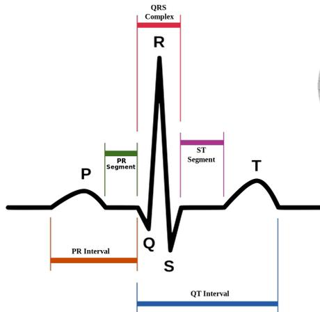

<a id="figure-11"></a>
**Figure 1.1: Typical ECG Waveform of a Heartbeat**  
 The public domain ECG image is created by Anthony Atkielski. Because of the activation through an abnormal pathway rather than the efficient cardiac conduction system, the conduction time is prolonged, causing a widened QRS complex on the ECG. In addition, since it originates in the ventricles, atrial depolarization does not occur and thus P wave is absent [[13](#ref-13)].

Three or more consecutive premature ventricular contractions (PVC or VPC) with a ventricular rate exceeding 100 beats-per-minute (BPM) is termed ventricular tachycardia (VT). VT is an unstable rhythm that causes drops in the cardiac output. It can quickly degenerate to ventricular fibrillation and leads to complete cardiac collapse. Figure 1.2 showed a typical ECG strip containing VT.

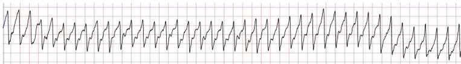

<a id="figure-12"></a>
**Figure 1.2: An ECG Strip of Ventricular Tachycardia**  
 Taken from record 421 of the MIT-BIH Malignant Ventricular Ectopy Database (VFDB)

The atrial rhythm and rate cannot be determined. The ventricular rhythm is mostly regular or slightly irregular, with a rapid rate between 100 – 250 BPM. The P wave is usually absent and the QRS complex is wide and bizarre.

Several variations of VT exist. Monomorphic VT has QRS complexes in a uniform shape while frequently changing QRS complex can be seen in polymorphic VT. Torsades de pointes is a kind of polymorphic VT with a rapid and irregular rate between 250 and 350 BPM. It has QRS complexes that keep changing. The amplitude of each successive QRS complex gradually increases then decreases. Overall, this pattern looks spindle-shaped. Ventricular flutter, another variant of VT is triggered by a single ventricular focus firing at a rapid rate of 250 to 350 BPM, causing a sine-wave like appearance [[13](#ref-13)].

Ventricular fibrillation (VF) is caused by disorganized electrical activities arising from many different foci in the ventricles. Consequently, the cardiac ventricles quiver instead of contract, so there is no effective muscular contraction or cardiac output. Without prompt treatment, it leads to ventricular standstill and death. Figure 1.3 demonstrated the typical look of VF.


<a id="figure-13"></a>
**Figure 1.3: An ECG Strip of Ventricular Fibrillation**

Taken from record cu01 of the Creighton University Ventricular Tachyarrhythmia Database (CUDB)

On the ECG strip containing VF, one can see fibrillatory waves with no recognizable pattern or regularity. The heart rate, P wave, PR interval, T wave, and QT interval, therefore cannot be determined. VF rhythms with large fibrillatory waves are called coarse VF while the ones with small waves are named fine VF. [[13](#ref-13)]

Currently, AED manufacturers follow some existing standards such as the ones published by ANSI Association for the Advancement of Medical Instrumentation (AAMI). To help the development and correct evaluation of the performance of AED algorithms, the American Heart Association (AHA) organized a task force on the AED and published a statement in 1999 and suggested that all AEDs should meet similar algorithm performance specifications [[28](#ref-28)]. The guideline covered several aspects of AED algorithm evaluation.

The AHA guideline classifies all cardiac rhythms into three broad categories which

AED algorithms should recognize and then decide whether it should deliver a defibrillation shock or not [[28](#ref-28)].

- Shockable rhythms: This group is composed of coarse VF and rapid VT. Rapid VT refers to VT with a heart rate more than 180 BPM. Patients with these rhythms are the ones for whom defibrillation can bring the greatest benefit with nearly no risks. Therefore when an AED algorithm sees these rhythms, a decision to deliver a shock should be made. Coarse VF means VF with larger amplitude. The AHA statement refers to VF with an amplitude more than 0.2 millivolts (mV) as coarse VF while some other ECG text books use a threshold of 0.3 mV instead [[1](#ref-1)].
  - Intermediate rhythms: This group contains fine VF and slower VT, for which the benefit of delivering a shock is uncertain.
  - Non-shockable rhythms: All of the other cardiac rhythms belong to this class, including asystole which means no electrical activity at all. Delivering an electric shock to these rhythms not only provides no benefit to the patients, but it is also considered harmful and could cause damage. For this rhythm class, no shock should be given. According to the AHA guideline, the following non-shockable rhythm types should be included in the dataset used for algorithm testing [[28](#ref-28)].
    - Normal sinus rhythm (NSR)
    - Supraventricular tachycardia (SVT), including sinus tachycardia (ST), bundle branch block (BBB), pre-excitation
    - Sinus bradycardia (SB)
    - Premature ventricular contraction (PVC or VPC)
    - Atrial fibrillation (AF)
    - Atrial flutter (AFL)
    - Second- or third-degree atrio-ventricular block (AV blocks)
    - Idioventricular rhythms (IVR)
    - Asystole

For the shockable rhythms, a high sensitivity is required while for the non-shockable ones a high specificity is desired since patient without VF or rapid VT should not receive any defibrillation treatment. The requirements for all rhythm classes were listed in Table 1.1.

<a id="table-11"></a>
Table 1.1: AHA Performance Specifications for Arrhythmia Analysis Algorithms

| Rhythms                             | Minimum Test Sample Size | Performance Goal  |
|-------------------------------------|--------------------------|-------------------|
| Shockable                           |                          |                   |
| Coarse VF                           | 200                      | >90% sensitivity  |
| Rapid VT                            | 50                       | >75% sensitivity  |
| Nonshockable                        | 300 total                |                   |
| NSR                                 | 100                      | > 99% specificity |
| AF, SB, SVT, heart block, IVR, PVCs | 30                       | > 95% specificity |
| Asystole                            | 100                      | > 95% specificity |
| Intermediate                        |                          |                   |
| Fine VF                             | 25                       | Report only       |
| Other VT                            | 25                       | Report only       |

Although AEDs have been used widely and have improved survival of OHCA, these devices are far from perfect. A study published in 2006 analyzed weekly US Food and Drug Administration (FDA) Enforcement Reports between January 1996 and December 2005 to identify all recalls and safety alerts of AEDs. Malfunction of AEDs was not unusual. During the study period, 21.2% of AEDs distributed were recalled, most often due to electrical or software problems [[25](#ref-25)]. In 2015, Nishiyama et al. tested the performance of commercially available AED systems [[40](#ref-40)]. It revealed that some commercially available AEDs correctly recognized VF in most cases, but when diagnosing VT, the diagnostic accuracy was not as impressive. No AEDs investigated in the study could attain both a  $> 75\%$  sensitivity for rapid VT and a  $> 95\%$  specificity for SVT. Obviously, there were still rooms for further improvement in the diagnostic algorithms.

## 1.2 Motivation

Traditionally, analysis of ECG mostly based on some simpler signal processing and pattern recognition techniques. Lately, using machine learning approaches to analyze ECG patterns became popular [[6](#ref-6)]. Sansone et al. provided a review on ECG pattern recognition using support vector machine (SVM) and artificial neural network in 2013 [[43](#ref-43)]. However, most of these researches focused on beat type classifications for isolated beats and tried to distinguish every single abnormal beat type from a normal beat. In AED applications, on the contrary, the algorithms need to classify the whole ECG rhythm segment and make a correct shock/no-shock decision with the performance requirements set by the AHA. For the purpose of application in AEDs, Amann et al. did a quite comprehensive review of the reliability and performance of existing VF detection methods in 2005 [[6](#ref-6)]. Some of the methods utilized statistical information of the data sequence or auto-correlation function in the time domain. Some did spectral analyses in the frequency domain, while others used more complicated techniques such as complexity measures or wavelet transforms. In a binary classification setting discriminating VF and non-VF rhythms from an 8-second ECG segment, the overall sensitivity of the evaluated algorithms tested against MITDB, CUDB, and AHA database ranged from 9.0 % to 92.5 % while the specificity was 35.0 %

- 99.9 %, which varied a lot. No single method was both good in terms of sensitivity and specificity [[6](#ref-6)]. Following these results, Alonso-Atienza et al. tried to aggregate 13 existing weaker VF detection algorithms together with machine learning techniques based on SVM to make better predictions of VF or shockable rhythms [[3](#ref-3)]. Tested against MITDB, CUDB, and VFDB datasets, they achieved a sensitivity of 91.9 % and a specificity of 97.1 % while recognizing a VF rhythm from an 8-second ECG segment. The accuracy was also high, being 96.8 % for VF/non-VF binary classification. However, just like other similar researches, these results could not be directly applied to AED scenario either. Most of the studies performed binary classification rather than multiclass classification and hence did not make any distinction between coarse and fine VF or rapid and slower VT as required by the AHA. So the correct prediction of VF did not correspond to a correct decision of delivering a defibrillation shock. Second, the datasets they used might not have rhythm types that were diverse enough to ensure generalizability. Furthermore, the performance metrics reported were not in the format recommended by the AHA. For example, the AHA guideline suggested that sensitivity for coarse VF and rapid VT should be reported along with specificity of other non-shockable rhythms, each of which had different performance goals.

Among the literature we have reviewed, many of the VF detection studies did not follow the recommendations of the AHA guideline for AED. The studies by Jekova et al. in 2002, 2004, and 2007 followed the AHA guideline in most parts of the study design and had a sensitivity of 93.4 % and specificity of 94.3 % [[22](#ref-22), [23](#ref-23), [24](#ref-24)]. However, the rhythm types (6 – 12) included in these studies were less diverse. Moreover, part of their dataset and annotations were private and not available to other researchers, making the direct comparison with their results or improvement based on their work more difficult. Also, the performance reported was the in-sample performance, rather than tested against a separate test or validation set, which might over-estimate the performance. The study by Anas et al. in 2010 tried to follow the AHA recommendations, but they only followed the suggested classification scheme and did not follow the performance evaluation part [[8](#ref-8)]. Despite the impressive performance being reported in previous researches, the lack of compliance with a common medical standard might make their clinical relevance more uncertain.

Another issue in performance metrics might be less obvious, but we need to take it into account. In these publicly available ECG datasets, VF samples only composed of a small fraction of them. For instance, in MITDB, which is popular when testing the ECG algorithms, nearly 90 % of the samples in it are non-shockable rhythms which can largely dominate the result of accuracy. Merely reporting the accuracy when such a highly unbalanced dataset is used can be flawed. Last, some of the existing studies either used private datasets or did not provide their source code, so repeating their experiments or comparing these studies directly became impossible.

To address the issues mentioned above, we compiled a more diverse dataset based on all publicly available free ECG datasets and tried to make the experiment settings as close to the AHA recommendations as possible. Moreover, all of the source code for this study is open-source software which can be downloaded freely from the Internet. This will facilitate future studies in the same field. It is relatively easy to utilize the datasets we have collected and to follow our workflow, and then make further improvement. Trying to reproduce the experiments and validate our results are also possible.

## 1.3 Organization of the Thesis

This thesis is organized as follows. Chapter 2 describes the detailed description about each step of this study, including, but not limited to data collection, feature extraction methods, and the classification algorithms. Chapter 3 presents the experiment results and performance evaluation of the proposed system. A discussion regarding the results is provided in chapter 4. Finally, chapter 5 concludes the current study.

# Chapter 2

# Methodology

The workflow of the study was summarized in Figure 2.1.

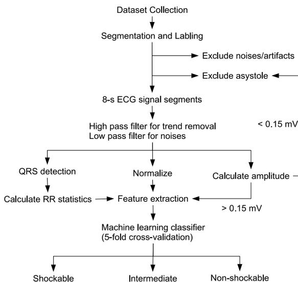

```
graph TD; A[Dataset Collection] --> B[Segmentation and Labeling]; B --> C[8-s ECG signal segments]; B --> D[Exclude noises/artifacts]; B --> E[Exclude asystole]; E --> F[< 0.15 mV]; C --> G[High pass filter for trend removal<br/>Low pass filter for noises]; G --> H[QRS detection]; G --> I[Normalize]; G --> J[Calculate amplitude]; H --> K[Calculate RR statistics]; I --> L[Feature extraction]; J --> M[> 0.15 mV]; M --> L; K --> L; L --> N[Machine learning classifier<br/>(5-fold cross-validation)]; N --> O[Shockable]; N --> P[Intermediate]; N --> Q[Non-shockable];
```

<a id="figure-21"></a>
**Figure 2.1: Flowchart of the Ventricular Arrhythmia Classification Process**

## 2.1 Datasets Collection

One of the goals of this study was to compile a more comprehensive free dataset suitable for researches on AED algorithms. Among existing studies, the publicly available datasets hosted by Physionet.org were extensively used. Some studies also included AHA database, but it is not freely available for download. Among the public free datasets, the MIT-BIH Arrhythmia Database (MITDB), MIT-BIH Malignant Ventricular Arrhythmia Database (VFDB), and Creighton University Ventricular Tachyarrhythmia Database (CUDB) were frequently used for studies related to ventricular fibrillation [[17](#ref-17)]. However, these databases were not designed specifically for this purpose and the case numbers of ventricular arrhythmias were relatively low. Hence we reviewed other publicly available free datasets seeking for more cases of ventricular arrhythmias. Furthermore, for safety reason, a high specificity was very critical for the non-shockable rhythms and this was stressed in the AHA recommendations for AED development as well. To improve generalizability of the machine learning algorithm and to make sure the algorithms have adequate specificity, it could be better if we have a more diversified dataset. Therefore, in this study, we tried to include ECG signals from the European ST-T Database (EDB) and added some more ventricular arrhythmia signals picked from Massachusetts General Hospital/Marquette Foundation (MGH/MF) Waveform Database (MGHDB) whenever applicable. The signal recorded in MITDB contained two channels and we only used the first one which was recorded from lead II. This was closer to the setting of AEDs. The MGHDB gathered various types of physiological signals in multiple channels. We only selected the channels containing lead II ECG strips as well.

Ventricular tachycardia with a heart rate more than 180 beat-per-minute was defined as rapid VT and classified in the shockable group along with VF. On the other hand, VT with a heart rate slower than 180 BPM did not require an electric shock and was in the intermediate group. To make this distinction when labelling the VT ECG segments, we needed precise information about their heart rates. So we could only include ECG segments with proper beat annotations for which the heart rate could be derived reliably. The ECG samples annotated as VT in VFDB were excluded from our study for this reason.

However, those marked as ventricular flutter (VFL) were still included since by definition VFL is an extreme form of rapid VT.

For CUDB, we excluded all of the samples marked as NSR. The database focused on VF only and according to its documentation other non-VF rhythms, including VT, were all annotated as NSR. That implied some potentially shockable or intermediate rhythms were labelled as normal rhythms in their annotation files. Therefore, these samples should not be included in our study. This issue was not addressed by many previous studies using the database.

### 2.1.1 Segmentation

According to previous studies of ventricular arrhythmia classification problems and our preliminary tests, a segment size of 8 seconds was suitable for this purpose [[3](#ref-3)]. Because the AHA recommendations for AED required reporting performance on artifact-free samples, segments marked as containing artifacts in their annotations were excluded from this study. The artifact-free parts were then split into different large chunks based on their rhythm annotations in the database. Then, in each chunk of the same rhythm type, we performed non-overlapping segmentation with a segment size of 8 seconds. Finally, each of the 8-second ECG segment was referred to as a sample in this study. The training and prediction tasks were performed on these 8-second samples.

## 2.2 Preprocessing

Some studies performed filtering and other pre-processing prior to data segmentation. However, this did not reflect the real clinical scenario where a long recording was not available when the AED leads were just attached to the patient. Therefore, we performed segmentation first, simulating the clinical settings of AED usage. The algorithm only got an ECG segment, and should perform the prediction correctly based solely on processing that segment.

All ECG segments underwent these standard pre-processing steps proposed in previous studies [[3](#ref-3)].

1. Mean subtraction
2. Normalization (this step was skipped when calculating the amplitude feature since we needed the original voltage values of the ECG signals)
3. Five order moving average
4. Drift suppression with a cutoff frequency of 1 Hz (high-pass filtering) [[14](#ref-14)].
5. Lowpass filtering with a Butterworth filter using a cutoff frequency of 30 Hz. To prevent phase distortion, we used a zero-phase filter here.

In some articles, resampling all ECG signal from different databases to the same sampling rate was suggested. Since most of the features we used in the study already performed normalization based on the length of the data sequence, resampling to the same sequence length might not be necessary. Thus we only performed resampling when the feature explicitly required a specific sampling rate, which will be described in later sections.

### 2.2.1 Measure Amplitudes

When measuring the amplitude of ECG signals, we used the peak-to-peak amplitude. A simple derivative-based method implemented by the scipy Python package (argrelmax() and argrelmin() functions) was used to find the peaks and valleys. Then, we calculate peak-to-peak amplitude for every pair of adjacent peaks and valleys. The global maximum of all peak-to-peak amplitude values was regarded as the overall amplitude of the whole ECG segment. The process was demonstrated in Figure 2.2. Before calculating the amplitude, we processed the ECG segments with the same denoising and drift suppression preprocessing mentioned earlier. However, the normalization step was not performed since we needed the raw amplitude values of the ECG signals.

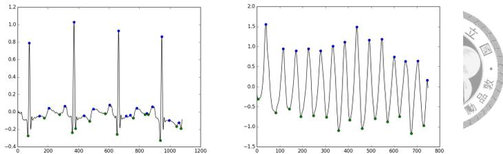

<a id="figure-22"></a>
**Figure 2.2: Detecting Peaks in ECG Signal for Estimating Peak-to-Peak Amplitudes**  
 The blue dots in the figure are the peaks and the green ones mark the valleys.

### 2.2.2 Asystole Detection

Asystole or standstill was diagnosed when there was no electrical activity in the ECG. However, for a signal processing application, it is not possible to get a completely flat line because of noise and artifacts. Also, note that fine VF means VF with a lower amplitude less than 0.2 mV. Hence in some extreme cases, it might not be possible even for human eyes to distinguish fine VF with a pretty low amplitude from asystole. So an operational definition of asystole was used here instead. We defined that an ECG segment with a maximum peak-to-peak amplitude less than 0.15 mV was treated as asystole. Since a patient with asystole should not be delivered a shock, these segments did not require machine learning classification since they were certainly non-shockable. These ECG segments were therefore excluded from further processing and classification tasks. However, if an ECG segment had an amplitude higher than 0.15 mV, but it was already manually marked as asystole in the annotation files coming with the ECG databases, we still regarded it as asystole.

### 2.2.3 Labelling

Based on the classification scheme suggested by the AHA, we needed to solve a multiclass classification problem. All of the ECG rhythms the algorithm received should be classified into three classes.

- Shockable: coarse VF and rapid VT (heart rate more than 180 BPM).

- Intermediate: fine VF (VF with a peak-to-peak amplitude less than 0.2 mV), and slow VT.
- Non-shockable: all other rhythm types.

### 2.2.4 Data Cleaning and Correction

During the experiments, we noted that some of the annotations in the original datasets provided by Physionet.org contained errors. The author of this thesis was a qualified practicing physician who received medical training in Taipei Veteran's General Hospital, one of the largest medical centers in Taiwan. With more than six years of ECG reading experience, the author was capable of correcting some of the obvious errors manually. Some ECG segments actually contained ventricular arrhythmias, but these segments were marked as normal in the original annotation files. In these cases, we revised their labels to the correct rhythm types whenever possible. If the annotation was incorrect, but the actual class was in doubt, the sample was excluded. Besides, according to the documentations, ECG segments containing high level of noise or artifacts should also be marked as such in their annotations. However, we noted that some of the ECG segments have poor signal quality, but no artifacts were marked in the annotation files. So we tried to manually exclude them with care.

## 2.3 Feature Extraction

Various techniques to recognize ventricular arrhythmias were proposed in existing literature. They could roughly be classified into time-domain features, frequency domain features, spectral analysis features, complexity measure-based features, etc. Table 2.1 summarized the feature sets of different domains adopted in previous similar VF detection researches we have reviewed. Among these features, time domain features and spectral analysis-based features were most frequently used.

<a id="table-21"></a>
Table 2.1: Features of Different Categories Used in Previous VF Detection Researches

| Year | Authors                   | time domin | frequency domain | complexity | EMD | phase space | others | Total |
|------|---------------------------|------------|------------------|------------|-----|-------------|--------|-------|
| 1990 | Thankor et al. [[44](#ref-44)]       | 1          | 0                | 0          | 0   | 0           | 0      | 1     |
| 1994 | Clayton et al. [[11](#ref-11)]       | 0          | 5                | 0          | 0   | 0           | 0      | 5     |
| 1999 | Zhang et al. [[49](#ref-49)]         | 0          | 0                | 1          | 0   | 0           | 0      | 1     |
| 2002 | Jekova and Mitev [[24](#ref-24)]     | 2          | 5                | 1          | 0   | 0           | 0      | 8     |
| 2002 | Moraes et al. [[38](#ref-38)]        | 0          | 1                | 1          | 0   | 0           | 0      | 2     |
| 2004 | Jekova and Krasteva [[23](#ref-23)]  | 3          | 0                | 0          | 0   | 0           | 1      | 4     |
| 2005 | Amann et al. [[5](#ref-5)]          | 0          | 0                | 0          | 0   | 1           | 0      | 1     |
| 2005 | Amann et al. [[6](#ref-6)]          | 5          | 4                | 1          | 0   | 0           | 3      | 13    |
| 2007 | Amann et al. [[7](#ref-7)]          | 0          | 0                | 0          | 0   | 1           | 0      | 1     |
| 2007 | Pardey [[41](#ref-41)]               | 1          | 0                | 1          | 0   | 0           | 0      | 2     |
| 2007 | Neurauter et al. [[39](#ref-39)]     | 4          | 6                | 0          | 0   | 0           | 0      | 10    |
| 2007 | Jekova [[22](#ref-22)]               | 5          | 4                | 1          | 0   | 0           | 0      | 10    |
| 2008 | Zhang et al. [[50](#ref-50)]         | 19         | 0                | 0          | 0   | 0           | 0      | 19    |
| 2009 | Li et al. [[32](#ref-32)]            | 0          | 0                | 1          | 0   | 0           | 0      | 1     |
| 2010 | Anas et al. [[8](#ref-8)]           | 1          | 0                | 0          | 1   | 0           | 0      | 2     |
| 2011 | Arafat et al. [[9](#ref-9)]         | 1          | 0                | 0          | 0   | 0           | 0      | 1     |
| 2012 | Alonso-Atienza et al. [[2](#ref-2)] | 4          | 4                | 1          | 0   | 2           | 0      | 11    |
| 2014 | Xia et al. [[48](#ref-48)]           | 0          | 0                | 0          | 5   | 0           | 0      | 5     |
| 2014 | Alonso-Atienza et al. [[3](#ref-3)] | 5          | 4                | 2          | 0   | 2           | 0      | 13    |
| 2014 | Li et al. [[33](#ref-33)]            | 3          | 9                | 1          | 0   | 1           | 0      | 14    |
| 2014 | Alwan et al. [[4](#ref-4)]          | 0          | 5—15             | 0          | 0   | 0           | 0      | 0     |
| 2014 | Lee et al. [[30](#ref-30)]           | 7          | 0                | 0          | 0   | 4           | 0      | 11    |
| 2015 | Karthika et al. [[27](#ref-27)]      | 5          | 3                | 1          | 0   | 2           | 7      | 18    |
| 2015 | Kalidas and Tamil [[26](#ref-26)]    | 6          | 5                | 0          | 0   | 0           | 0      | 11    |

Amann et al. did a review of many well-known features in 2005 [[6](#ref-6)]. They concluded that among the various features they tested, the best ones worked in the time domain. The spectral parameters utilized the information about energy distribution from within the frequency domain, but did not use phase information. The complexity-based algorithms had a poor performance in the region where specificity  $> 80\%$ . From the viewpoint of a physician, features of different categories had different clinical implications. For example, a high threshold-crossing count in the time domain or a higher peak frequency in the power spectrum actually implied a rapid heart rate. The complexity-based methods, on the other hand, captures the irregularity of VF rhythms, which was also part of the ECG interpretation process of a cardiologist. As different features excelled in various aspects of VF detection, aggregating their results with a machine learning classifier might improve the overall performance. Furthermore, many existing studies focused on binary classification problems which recognized VF only and the simple feature sets they proposed might not be sufficient for a multiclass problem we tried to solve. Therefore, in this study, we extracted 27 features of different domains from each 8-second ECG segment. The extracted features and their characteristics were summarized in Table 2.2.

<a id="table-22"></a>
Table 2.2: Features Extracted from Each ECG Segment

| Category            | Features                                       | Characteristics                                            | Number |
|---------------------|------------------------------------------------|------------------------------------------------------------|--------|
| Time domain         | TCI, TCSC, STE, MEA, Count 1–3, Amplitude, MAV | Detect wide QRS tachycardia with larger amplitudes         | 9      |
| Frequency domain    | M, A2, FM, VF Leak                             | Detect narrow-band, high frequency, sine-wave like signals | 4      |
| Complexity measures | LZ, SpEn                                       | Detect irregularity of signal                              | 2      |
| EMD                 | LZ of IMF1–5                                   | Help distinguish VF and VT                                 | 5      |
| Phase space         | PSR, HILB                                      | Detect irregularity of signal                              | 2      |
| QRS beat detector   | RR interval statistics, beat type              | Used by clinicians during ECG interpretation               | 5      |

TCI: threshold crossing interval; TCSC: threshold crossing sample count; STE: standard exponential; MEA: modified exponential; MAV: mean absolute value; M, A2: spectral parameters; FM: central frequency; VF: VF filter (VF leak); LZ: Lempel-Ziv complexity; SpEn: sample entropy; EMD: empirical mode decomposition; IMF: intrinsic mode function; PSR: time-delayed method (phase space reconstruction); HILB: Hilbert transform;

### 2.3.1 Time-Domain Features

Since the ECG signal is a quasi-periodic waveform, the amplitude of the signal varies along with time. When its amplitude exceeds a threshold defined by us, this is called threshold-crossing. Many time-domain features were based on some threshold crossing related statistics. By definition, VF and VT are tachycardias with wide QRS complexes. With a rapid heart rate, if the amplitude of the signal is large enough, it will cross an amplitude threshold for more times than normal rhythms. Not only the counts of threshold crossing will increase, but the numbers of the samples with values above the threshold might also increase due to the widened QRS wave. This explained the basic ideas behind this kind of features. Several variations of this idea were proposed by different authors, but most of them mainly differed in the threshold chosen. Figure 2.3 summarized the comparison of some threshold crossing-based methods.

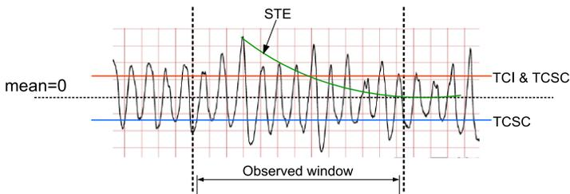

<a id="figure-23"></a>
**Figure 2.3: Comparison of Threshold Crossing-Based Methods**

Various threshold-crossing-based algorithms were different mainly in the threshold values chosen. For example, TCI used a positive 20 % threshold, TCSC considered both the positive and negative 20 % thresholds. STE, the standard exponential methods, used a time-varying threshold value based on an exponential curve arising from the maximum peak in the observed window.

#### Threshold-Crossing Interval (TCI)

Threshold crossing interval was proposed in 1990 [[44](#ref-44)]. It measures the average duration between two threshold-crossing pulses in a one-second segment of the ECG signal. For our eight-second ECG segments, we split our ECG segment into eight one-second segments, and calculate the TCI value for each of them. Then, their average was used as our TCI feature. The detailed calculation of TCI is as follows.

$$TCI = \frac{1000}{(N - 1) + \frac{t2}{(t1+t2)} + \frac{t3}{(t3+t4)}}$$

Where N signifies the number of threshold crossing pulses in the one-second segment, and the meaning of t1, t2, t3, and t4 are depicted in Figure 2.4. The number 1000 means 1000 milliseconds (one-second segment). According to previous studies, we set the threshold value to 20 % of the maximum value within the one-second segment. From the equation, one can see that if you have a more rapid heart rate and most your QRS complexes are taller than the 20 % threshold, you will have more threshold crossing pulses in the same time period, which leads to a lower TCI value. Hence, this feature might be able to capture rapid heart beats with larger amplitudes. A TCI value more than 400 ms was used to exclude VF in previous study [[44](#ref-44)].

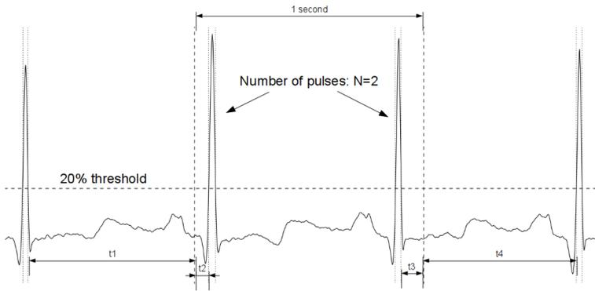

<a id="figure-24"></a>
**Figure 2.4: Threshold Crossing Interval (TCI) Calculation**

#### Threshold-Crossing Sample Count (TCSC)

Very similar to the basic idea of TCI, but the authors proposing TCSC tried to improve it in several ways [[9](#ref-9)].

- It considered both positive and negative threshold crossings.

- It calculated the sample counts above the thresholds.

This not only reflects the amplitude of the peaks, it also correlates with their widths. With a wide QRS complex, meaning a wide R or S parts, it takes more time for a rising R peak to fall and the duration between the two threshold-crossing points created by the rise and fall of a peak becomes longer. This results in more threshold-crossing samples. So the threshold crossing sample count might be higher in wide QRS tachycardia. Before calculating TCSC, the author proposed multiplying the ECG segment with a Tukey window (referred to as a cosine window in the original paper). The cosine window can lower the effects of incomplete ECG beat waveforms at both ends of the segment. The detailed steps to calculate TCSC are as follows.

1. Multiply the ECG segment by a Tukey window  $w(t)$ .

$$w(t) = \begin{cases} \frac{1}{2}(1 - \cos(4\pi t)) & 0 \leq t \leq \frac{1}{4} \\ 1 & \frac{1}{4} \leq t \leq L_s - \frac{1}{4} \\ \frac{1}{2}(1 - \cos(4\pi t)) & L_s - \frac{1}{4} \leq t \leq L_s \end{cases}$$

where  $L_s$  is the length of the 3-second ECG segment.

2. Normalize the ECG signal by the absolute maximum in the segment.
3. Counting the percent of sample values greater than the threshold  $V_0$ , which is set to 0.2 by this equation:

$$N = \frac{\text{Number of samples that cross } V_0}{\text{Total number of samples}} \times 100$$

4. Calculate seven  $N$  values using a 3-second moving window in the whole 8-second ECG segment with a one-second step size, and then use their average as the TCSC feature.

#### Auxiliary Counts (Count1, Count2, Count3)

These features are named auxiliary counts by their creators[[23](#ref-23)]. From their names, it is not obvious what they do. However, they are still similar to the threshold-crossing techniques we just explained. One of the most obvious differences is the threshold used. Rather than using a 20 % threshold, these auxiliary counts utilize some simple statistical values obtained from the ECG segment. Before calculating the values, the ECG segment needs to be preprocessed with a low-pass filter designed for a 250 Hz sampling frequency.

$$FS_i = \frac{14FS_{i-1} - 7FS_{i-2} + \frac{S_i - S_{i-2}}{2}}{8}$$

Where  $S_i$  is the  $i$ -th signal sample within the original signal  $S$ , and  $FS_i$  is the  $i$ -th sample point in the filtered signal  $FS$ .

Count 1, Count2, and Count3 then calculate the number of samples with amplitudes within three different ranges, respectively.

- Count1 – Range:  $0.5 \times \max(AbsFS)$  to  $\max(AbsFS)$
- Count2 – Range:  $\text{mean}(AbsFS)$  to  $\max(AbsFS)$
- Count3 – Range:  $\text{mean}(AbsFS) - MD$  to  $\text{mean}(AbsFS) + MD$

Where  $AbsFS = \{|FS_1|, |FS_2|, |FS_3|, \dots\}$  and  $\max(AbsFS)$ ,  $\text{mean}(AbsFS)$  and  $MD$  (mean deviation) are computed for every 1-second time interval. From these formulas, one may notice their resemblance with TCSC or TCI. Count1 is essentially the number of samples that cross the 50 % threshold. Rather than choosing a fixed percentage, Count2 and Count3 determine the thresholds based on mean and mean deviation (MD) of the ECG segment in a one-second interval. The absolute values here make the auxiliary counts take the negative peaks or valleys into account, just like what TCSC does. Since the original algorithm is designed for use with a 250 Hz sampling rate, in our study, we resampled the ECG segments to 250 Hz before calculating the auxiliary counts.

#### Standard Exponential (STE) and Modified Exponential (MEA)

Standard exponential and modified exponential, documented by Amann et al. in 2005 [[6](#ref-6)], are another two threshold-crossing based measures in the time domain. Instead of using a fixed threshold value, as the names imply, their thresholds change over time as exponential curves. For the standard exponential method, first, identify the largest peak in the ECG segment. Then, use the peak as the starting point to draw a declining exponential curve and calculate the number of intersections of the curve and the ECG waveform. The exponential function is defined as follows.

$$E_s(t) = M \exp\left(-\frac{|t - t_m|}{\tau}\right)$$

where  $M$  represents the global maximum amplitude of the signal and  $t_m$  is the corresponding time where the peak happens. Time constant  $\tau$  is set to 3 seconds empirically in the original study. The final intersection count is divided by the length of the signal for normalization.

Modified exponential is a modified version of STE. Rather than using a fixed exponential curve starting from the global peak, it draws the exponential curve from a local maximum. Then, it tries to lift the curve again to the next local maximum whenever a cross happens during the exponential declining of its amplitude. Finally, calculate how many times the exponential curve is lifted. The exponential function is also defined slightly differently.

$$E_{n,j} = \begin{cases} M_j \exp\left(-\frac{t - t_{m,j}}{\tau}\right) & t_{m,j} \leq t \leq t_{c,j}, \\ \text{given ECG signal} & t_{c,j} \leq t \leq t_{m,j+1} \end{cases}$$

$M_j$  denotes the amplitude of the  $j$ -th local maximum of the signal, and  $t_{m,j}$  is its corresponding time. The time constant  $\tau$  here is set to 0.2 seconds.

The paper of Amann et al. did not mention the method they used to find the local maximums. Hence, in this thesis, we use a simple method `scipy.signal.argrelmax()` implemented in the `scipy` Python software package.

#### Mean Absolute Value (MAV)

MAV is proposed by Anas et al. to distinguish VF and VT from other rhythms in 2010 [[8](#ref-8)]. As its name implies, it calculates the absolute strength or the mean of the absolute value of a signal segment  $x(n)$  of length  $N$  as follows.

$$MAV = \frac{1}{N} \sum_{n=0}^{N-1} |x(n)|$$

In the original paper, the author proposed a fixed number  $N = 2 \text{ second} \times \text{sampling rate (Hz)}$ . (For example, for ECG signal from CUDB that has a sampling rate of 250 Hz, set  $N = 250 \times 2 = 500$  sample points.) Then, slide this window of size  $N$  with one-second step through the whole ECG segment of length  $Le$  and get  $Le - 1$  MAV values. Finally, calculate the mean of these  $Le - 1$   $MAV_i$  values as follows and their average  $MAV_a$  can be used as a feature to recognize VF and VT.

$$MAV_a = \frac{1}{Le - 1} \sum_{i=1}^{Le-1} MAV_i$$

#### Amplitude (AMP)

Since fine VF is VF with an amplitude lower than 0.2 mV, to distinguish coarse VF from fine VF, we might need the peak-to-peak amplitude of the ECG segments. Moreover, these ventricular arrhythmias originate from cardiac ventricles and had a distinct morphology which sometimes have larger amplitudes than normal QRS complexes. Hence we tried to include the amplitude of the ECG segment as a feature.

### 2.3.2 QRS Detector-Based Features

Using simple threshold crossing methods to reflect a rapid heart rate might not as precise as it looks like. For example, when the T wave is gigantic, which might be seen during ischemia, hyperkalemia, and other causes, threshold crossing count might also increase. If we can know the exact position of every QRS complex, the result might be more accurate. There were many different QRS complex detection algorithms with high sensitivity and specificity reported in the literature [[16](#ref-16)]. One of the popular and freely available solutions was the open-source software package provided by Patrick S. Hamilton which can be downloaded from the website of E.P. Limited (<http://www.eplimited.com/>) [[19](#ref-19)]. We used it directly in this study.

#### RR Interval Statistics

In ECG reading, RR interval refers to the duration between two adjacent R peaks (the unit is often millisecond). The more rapid the heart rate, the closer the R waves of the adjacent heartbeats. Shorter RR intervals imply a more rapid heart rate. Besides, a normal sinus rhythm has a nearly regular period and hence fewer variations in its RR intervals. Arrhythmias, by definition, are irregular and have variable RR intervals. So variability of RR interval might be an indicator of arrhythmias. For these reasons, we made two features out of the average and standard deviation of RR intervals derived from the results of QRS detection (denoted by RR and RR\_Std in later sections). The value of the standard deviation, however, is affected by the lengths of the RR intervals as well. With the same degree of variability, larger RR intervals results in larger standard deviation of RR. To overcome the problem, we also calculated the coefficient of variation of RR intervals (referred to as RR\_CV later), which is calculated by  $RR\_CV = \frac{\text{standard deviation of RR}}{\text{mean RR}}$ . Note that in some cases, such as when the amplitude of the signals is too low, the QRS beat detector can fail and we cannot derive these values. In this case, we arbitrarily set RR, RR\_Std, and RR\_CV to zero.

#### Beat Type Detection

The QRS detector not only detected the position of QRS complexes, but it also tried to do simple beat type classification (normal, VPC, and unknown type). Since VPC beats had wide QRS complexes, just like VF and VT, and VT was defined as three or more consecutive VPCs with a heart rate faster than 100 BPM, knowing the beat types in the ECG sample might be useful. Besides, VF beats were more disorganized and might be recognized as an unknown beat type by the QRS detector sometimes. If we can leverage the simple beat detection results of the QRS detector, this might help make the distinction between these abnormal rhythms. To reflect the idea, we calculated two features, unknown beat ratio (UR) and VPC beat ratio (VR).

$$UR = \frac{\text{number of unknown beats detected}}{\text{number of all beats detected}}$$

$$VR = \frac{\text{number of VPC beats detected}}{\text{number of all beats detected}}$$

### 2.3.3 Frequency-Domain Features

In addition to morphology and other time-domain statistics, it is also possible to analyze the power spectrum of the ECG signal in the frequency domain using Fourier transform. Compared with normal sinus rhythm, ventricular fibrillation and tachycardias generally have faster heart rates, so the main frequencies of them might be higher in the power spectrum. Furthermore, the shape of VT and VF are closer to a sine wave than normal sinus rhythms. This could result in narrower frequency bands in the power spectrum. That is to say, Fourier transform of these ventricular arrhythmias might have different shapes and distributions from that of other non-shockable rhythms. So we have a chance to separate them in the frequency domain. Figure 2.5 demonstrated an example of Fourier transforms of normal sinus rhythm compared with VF, showing their differences.

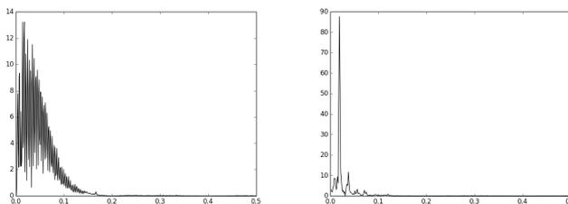

<a id="figure-25"></a>
**Figure 2.5: Fourier Transform of Normal Sinus Rhythm and VF**

The amplitude spectrum on the left side is the Fourier transform of an ECG segment containing NSR. The one on the right side is from a segment with VF. The spectrum of NSR is more broadband.

#### VF filter (VF)

VF filter, or VF leaks, was introduced in 1978 by S Kuo and R Dillman [[29](#ref-29)]. The technique is based on the assumption that the shape of VF and VT are close to sine waves. If you shift a sine wave by half of its period, and then add it to the original wave, the whole sine wave will be eliminated because after the phase shift, the peaks of the new sine wave are located in the valleys of the original sine wave, and vice versa. That means, if you have a waveform very similar to a sine wave, and you shift it by half of its period and add the shifted waveform to itself, most of the original waveform will be eliminated. On the contrary, if a waveform is not a sine wave like, which is the case of a normal sinus rhythm, after this procedure, most of the original waveform cannot be eliminated and will "leak". This technique is used to achieve the effect of central band elimination. The detailed steps of calculating VF leak are hence as follows.

- Fourier transform of the original signal.
- Find the frequency bin at which the amplitude is the largest. This is the main frequency of the signal.
- Derive the main period from the main frequency by  $\frac{1}{\text{main frequency}}$ .
- Shift the original signal by half of the period, and add it back to the original signal.
- Calculate the VF leak value as follows.

$$VFLeak = \frac{\sum_{i=T/2}^{N-1} |X_i + X_{i-T/2}|}{\sum_{i=T/2}^{N-1} [|X_i| + |X_{i-T/2}|]}$$

Where  $N$  is the number of sample points, and  $T$  is the period.

Different from the original paper, before doing Fourier transform, we multiplied the ECG signal by a Hamming window to do side-lobe suppression so we might have fewer ripples in the spectrum, potentially improve its quality.

#### Spectral Features (M, A2)

As just described previously, the spectrum of ventricular arrhythmias might have different distributions compared with that of normal sinus rhythm in the frequency domain. Some spectral parameters can be calculated to analyze the energy content in different frequency bands [[10](#ref-10)]. Most normal rhythms tend to be broadband signal and their major harmonics are up to around 25 Hz while VF might be concentrated in a band between 3 and 10 Hz. The spectral parameters M and A2 can help reflect differences of distribution in the amplitude spectrum of the ECG signal. Before calculating these values, some preprocessing is needed.

- Multiply the ECG segment by a Hamming window for side-lobe suppression.
- Perform fast Fourier transform of the windowed ECG signal to get its amplitude spectrum
- In the frequency band 0.5 - 9 Hz, find the frequency of the component with the largest amplitude (peak frequency, denoted by  $\Omega$ ).
- Set all amplitude values which are less than 5% of the amplitude of  $\Omega$  to zero.

Then, the values M and A2 are calculated as follows.

$$M = \frac{1}{\Omega} \frac{\sum_{j=1}^{j_{max}} a_j w_j}{\sum_{j=1}^{j_{max}} a_j}$$

where  $j_{max}$  is the index of the highest invested frequency,  $\min(20 \Omega, 100 \text{ Hz})$ , in the frequency bins.  $w_j$  is the  $j$ -th frequency between the indices 1 and  $j_{max}$ , and  $a_j$  is the corresponding amplitude at frequency  $w_j$ .

$$A2 = \frac{\sum_{i=i_{min}}^{i_{max}} a_i}{\sum_{j=j_{min}}^{j_{max}} a_j}$$

where  $i_{min}$  and  $i_{max}$  are the indices of frequency  $0.7 \Omega$  and  $1.4 \Omega$ , and  $j_{min}$  and  $j_{max}$  are the indices of 0.5 Hz and  $\min(20 \Omega, 100 \text{ Hz})$  in the Fourier transform frequency bins.

#### Central Frequency of Power Spectrum (FM)

Introduced in 1990 [[15](#ref-15)], the central frequency is the frequency coordinate of the center of spectral mass of the power spectrum.

$$FM = \frac{\sum_{i=1}^n f_i p_i}{\sum_{i=1}^n p_i}$$

where  $f_i$  is the  $i$ -th frequency component in the power spectrum of the ECG signal and  $p_i$  is the power of  $f_i$ , and  $n$  is the number of frequency components in the power spectrum.

### 2.3.4 Complexity Measure-Based Features

Complexity measures can reflect the randomness of an ECG data sequence.

#### Lempel-Ziv Complexity (LZ)

In 1999, Zhang et al. demonstrated how to use the Lempel-Ziv complexity measure for VF detection [[49](#ref-49)]. Originally developed by Lempel and Ziv in 1976 [[31](#ref-31)], the Lempel-Ziv complexity measure quantitatively characterizes the complexity of a dynamical system. By transforming the input data sequence into binary strings composed of 1 and 0, we can search for repeating patterns in the sequence. The procedure used to convert ECG signals into binary string are as follows.

1. Mean subtraction of the ECG signal
2. Find the positive peak  $V_p$  and negative peak  $V_n$
3. Count the values of  $P_c$  and  $N_c$  which are the numbers of samples falling in the range  $0 - 10\% V_p$  and  $10\% V_n - 0$ .
4. Define a threshold as follows.

$$Td = \begin{cases} 0.0 & \text{if } (P_c + N_c) < 40\%n, \\ 20\%V_p & \text{if } P_c < N_c, \\ 20\%V_n & \text{otherwise} \end{cases}$$

5. Convert the ECG signal to a binary sequence  $s$  with the threshold  $Td$ . Samples with amplitudes less than  $Td$  were set to zero; set to one, otherwise.

Then we can calculate the Lempel-Ziv complexity of the finite binary sequence. The algorithm is relatively simple. Let  $S$  and  $Q$  denote two binary strings.  $SQ$  means the concatenation of  $S$  and  $Q$  and  $SQ\pi$  denotes the string derived from deleting the last character of  $SQ$ . ( $\pi$  represents the operation of deleting the last character from a string). Besides,  $v(SQ\pi)$  is the set composed of all possible substrings of  $SQ\pi$ . Then the algorithm to calculate Lempel-Ziv complexity can be summarized as the following pseudocode in Algorithm 1.

##### --- Algorithm 1 Lempel-Ziv Complexity ---

**Require:**  $s$  being a binary sequence containing only 0 or 1 of length  $n$

```

 $c(n) \leftarrow 1$ 
 $S \leftarrow s_1$ 
 $Q \leftarrow s_2$ 
 $i \leftarrow 2$ 
repeat
  if  $Q \in v(SQ\pi)$  then
     $S$  does not change
     $Q \leftarrow Qs_{i+1}$ 
  else
     $c(n) \leftarrow c(n) + 1$ 
     $S \leftarrow SQ$ 
     $Q \leftarrow s_{i+1}$ 
  end if
   $i \leftarrow i + 1$ 
until  $i = n$ 
 $b(n) \leftarrow n / \log_2 n$ 
 $C(n) \leftarrow c(n) / b(n)$ 
return  $C(n)$ 

```

---

To make the code cleaner and easier to understand, we did not follow some of the notations in the original paper and tried to present the algorithm in a slightly different way, but the logic and final operations being done remained unchanged.

#### Empirical Mode Decomposition (EMD)

To achieve better multiclass classification, we needed some features to distinguish ventricular fibrillation from ventricular tachycardia. According to the report from Xia et al in

2014 [[48](#ref-48)], this might be achieved by calculating the Lempel-Ziv complexity on the results of empirical mode decomposition (EMD) instead of on the original ECG signals. Empirical mode decomposition was proposed by Huang et al. in 1998 [[21](#ref-21)]. It can decompose the original signal into a set of intrinsic mode functions (IMFs). An IMF is a function that satisfies two conditions. 1. In the whole data set, the number of extrema and the number of zero crossings must either equal or differ at most by one 2. At any point, the mean value of the envelope defined by the local maxima and the envelope defined by the local minima is zero [[21](#ref-21)]. Figure 2.6 provided a simplified depiction of EMD calculation.

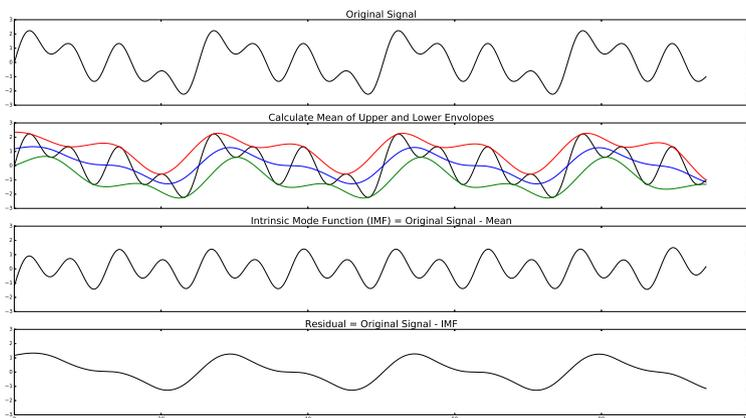

<a id="figure-26"></a>
**Figure 2.6: Steps of Empirical Mode Decomposition**

The first figure is the original signal. In the second step, the upper and lower envelopes and their mean were calculated. In the next step, the first intrinsic mode function (IMF) was obtained by subtracting the mean of envelopes from the original signal. Then, in the last step, the IMF was removed from the original signal and the remaining part was called residual. Repeating these steps for several iterations, the original signal could be decomposed into a set of IMFs.

The detailed steps to derive IMFs for an ECG signal segment are as follows.

1. Given an input signal  $x(t)$ , generate its upper envelope  $e_u(t)$  by connecting all of the maxima with cubic spline interpolation. Similarly, generate the lower envelope  $e_l(t)$  with local minima.

2. Calculate the local mean:

$$m(t) = \frac{(e_u(t) + e_l(t))}{2}$$

3. Subtract the local mean  $m(t)$  from the original signal and get

$$g(t) = x(t) - m(t)$$

4. Check if  $g(t)$  satisfied the two conditions mentioned above to determine if it is an IMF.
5. If  $g(t)$  is not an IMF, repeat the previous steps 2 – 4 until an IMF is obtained.
6. To find the next IMF, subtract the current IMF  $g(t)$  from the signal  $x(t)$  to get the residue  $r(t)$ . Set  $x(t) = r(t)$  and repeat the whole process again.

Xia et al suggested in their paper that IMF1 and IMF5 were better for discriminating VF and VT among the IMFs they have tested. However, because of differences in experimental settings, our results might not be the same as theirs, so we extracted IMF 1 – 5 and put all of them into our feature vectors for testing. Calculating the complexity of the IMF is only one of the methods to leverage EMD. There still exist other ways to extract features with EMD [[8](#ref-8)].

#### Sample Entropy (SpEn)

Sample entropy measures the rate of information production. It is based on the conditional probability that two sequences remain similar at the next point given they are already similar for  $m$  points [[32](#ref-32)] [[42](#ref-42)]. In other words, this indicates how predictable a sequence is. To calculate the entropy value, we need to take the negative logarithm of the conditional probability. So the less probable that the sequences remain similar at the next point, the more their randomness and entropy. The sample entropy of an ECG signal time series of  $N$  points  $\{u(i) : 1 \leq i \leq N\}$  can be calculated using the following steps described by Li et al. in their paper using dynamic sample entropy to detect VF [[32](#ref-32)].

1. Select a pattern length  $m$  to construct  $m$ -dimensional vectors:  $X(1), X(2), \dots, X(N - m + 1)$  Where  $X(i) = \{u(i), u(i + 1), \dots, u(i + m)\}$ . This essentially generates  $N - m + 1$  overlapping subsequences of the original ECG segment using a sliding window of size  $m$  and a step size of one sample point.

2. Define the distance measure between  $X(i)$  and  $X(j)$ :

$$d[X(i), X(j)] = \max_{k=0 \sim m-1} |u(i + k) - u(j + k)|.$$

This measures how different two subsequences  $X(i)$  and  $X(j)$  are.

3. Give a threshold distance  $r$ , construct  $C_i^m(r)$  for each  $\{i : 1 \leq i \leq N - m + 1\}$  :

$$C_i^m(r) = \frac{\sum_{j=1}^{N-m+1} \phi(i, j)}{N - m},$$

Where

$$\phi(i, j) = \begin{cases} 1, & \text{if } d[X(i), X(j)] < r \\ 0, & \text{otherwise} \end{cases}$$

$\phi(i, j)$  can be viewed as a similarity score for  $X(i)$  and  $X(j)$ . If the max distance between these two vectors is smaller than the threshold distance  $r$ , we consider them similar and they get a score of 1. Otherwise, 0 is given if the difference of the two sequences exceeds our tolerance  $r$ . Then  $C_i^m(r)$  calculates how many in the other  $N - m$  subsequences (denoted by  $X(j)$ ) are similar to a given subsequence  $X(i)$ , which reflects the probability that the other subsequence  $X(j)$  is similar to the given subsequence  $X(i)$ .

4. Average  $C_i^m(r)$ :

$$\phi^m(r) = \frac{1}{N - m + 1} \sum_{i=1}^{N-m+1} C_i^m(r)$$

$\phi^m(r)$  basically estimates the probability that any pairs of the  $N - m + 1$  subsequences are similar when a tolerance threshold  $r$  is given.

5.  $m \rightarrow m + 1$ , repeat above process to get  $\phi^{m+1}(r)$

**6. Sample entropy:**

$$SampEn(N, m, r) = \lim_{n \rightarrow \infty} \left\{ -\ln \frac{\phi^{m+1}(r)}{\phi^m(r)} \right\}$$

We already have  $\phi^m(r)$ . When given one more data point per subsequence, we can calculate another probability  $\phi^{m+1}(r)$ . Then sample entropy can be used to see how close they are. It is obvious from the formula that if  $\phi^m(r)$  and  $\phi^{m+1}(r)$  are identical, then the entropy will be zero, which means "not random at all".

The original paper imposed a sampling rate of 250 Hz and only used 1250 sample points to calculate the sample entropy value. So we followed the steps, resampled our ECG segment to 250 Hz, and only took the last 1250 sample points. This corresponded to the last five seconds of the whole 8-second ECG segment.

### 2.3.5 Phase Space Reconstruction

Proposed by the same authors consecutively, time-delayed method [[7](#ref-7)] and Hilbert transformation-based method [[5](#ref-5)] both exploited the relationship between an ECG waveform and its shifted version. This can be achieved with a 2-dimensional scatter plot. The X axis value of each point in the scatter plot is the amplitudes of the original signal samples, and its Y value is the amplitude of a shifted version of the same signal. This procedure is called phase space reconstruction. If the signal is quite regular, the scattered points should mostly be confined in some limited clusters on the plot. Otherwise, if the signal is completely irregular, just like the case of VF, the points in the phase space plot might spread over the whole plot randomly.

The main difference between these two methods is in the way they generate the shifted signal.

#### Time-Delayed Method (PSR)

The time-delayed method generates a shifted version of the original signal by delaying it for 0.5 seconds. So it is named time-delayed method [[7](#ref-7)]. Figure 2.7 is a demonstration of two phase space plots generated for normal sinus rhythm and VF with the time-delayed method.

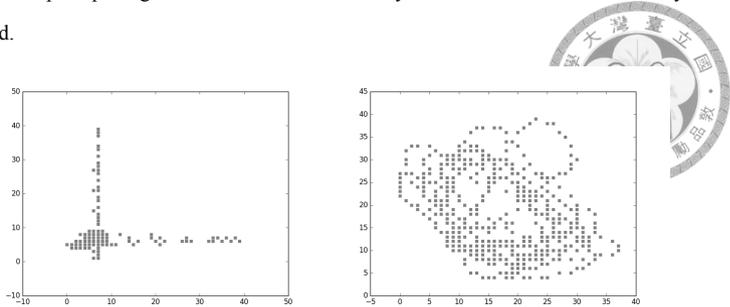

<a id="figure-27"></a>
**Figure 2.7: Phase Space Reconstruction for NSR and VF**

The phase space plot on the left side is generated from an NSR ECG segment, and the other one is from VF.

#### Hilbert Transformation (HILB)

Hilbert transformation is a mathematical tool used in signal processing to generate the so-called analytical signals. The result of Hilbert transform is a sequence of complex numbers whose imaginary part contains a variation of the original signal of the same amplitude with the phase shifted by  $\frac{\pi}{2}$ . So this shifted signal can be used for generating the phase space plot [[5](#ref-5)].

After generating the phase space plot, both methods make the scatter plot into a  $40 \times 40$  grid and calculate how many cells in the grid are visited by the scattered data point. Then the proportion of the visited cells in the all 1600 cells can be used as a feature to detect VF.

## 2.4 Machine Learning Algorithms for Classification

After extracting adequate features from the original ECG segments, we needed a machine learning algorithm to perform the final classification task and to make the correct shock/no-shock decision. We utilized the well-known machine learning algorithm support vector machine (SVM). In this section, we briefly introduced how the SVM algorithm works.

### 2.4.1 Soft Margin Support Vector Machine (SVM)

Originally named support vector network and proposed by Cortes and Vapnik in 1995 [[12](#ref-12)], the support vector machine algorithm is a machine learning model with high generalization ability. It features mapping the input vectors to a very high-dimensional space in which a linear decision surface is constructed [[12](#ref-12), [20](#ref-20)]. Figure 2.8 demonstrated the basic idea behind SVM. For better noise tolerance, SVM tries to find an optimal separating hyperplane between two different classes with the largest margin. As depicted in the figure, the margin in SVM refers to the minimal distance from all of the sample points to the hyperplane. We only need the vectors which are closest to the hyperplane, the support vectors, to define an optimal separating hyperplane with a large margin.

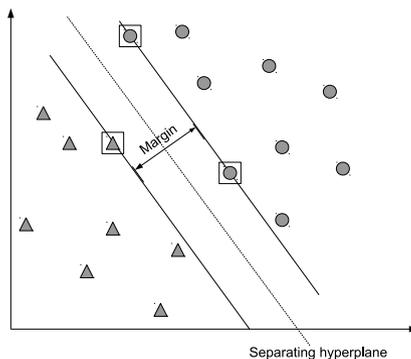

<a id="figure-28"></a>
**Figure 2.8: An Example for Support Vector Machine**

In the real world, not all of the classification problems are natively linearly-separable. Performing non-linear transformation on the features to map them into a higher dimensional space might help in this case. Figure 2.9 is a simple example showing the effect of non-linear transformation. The original problem on the left panel was not linearly-separable. Find a straight line separating the data points of these two different classes in the original space was not possible. However, after transforming the  $x$  and  $y$  to  $x^2$  and  $y^2$ ,

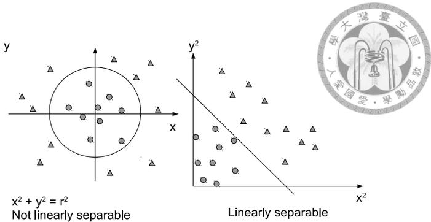

<a id="figure-29"></a>
**Figure 2.9: An Example of the Effect of Non-linear Transformation**

the binary classification problem became linear-separable.

In a high dimensional space, distance from a point  $z_i$  to a hyperplane  $w^T x + b = 0$  can be calculated by  $\frac{1}{\|w\|} |w^T z_i + b|$ . Finding the optimal hyperplane with the largest margin, therefore, becomes an optimizing problem finding the  $w$  and  $b$  to maximize  $\frac{1}{\|w\|} |w^T z_i + b|$  for each sample point  $z_i$ .

For a binary classification problem, given pairs of  $(x_i, y_i), i = 1, \dots, l$ , where  $x_i \in R^n$  and  $y_i \in \{1, -1\}^l$ , after mapping  $x_i$  into a high dimensional space by  $z_i = \phi(x_i)$ , the distance from  $z_i$  to the separating hyperplane becomes  $\frac{1}{\|w\|} |w^T z_i + b|$ . Since  $y_i = +1$  when  $w^T z_i + b > 0$  and  $y_i = -1$  when  $w^T z_i + b < 0$ , this can be changed to  $\frac{1}{\|w\|} y_i (w^T z_i + b)$ . Finding the maximum of this equation correspond to finding the minimum of  $ww^T$ .

Then, SVM requires the solution of the following primal optimization problem.

$$\min_{w,b,\xi_i} \frac{1}{2} w^T w + C \sum_{i=1}^l \xi_i$$

subject to the constraints

$$y_i(w^T z_i + b) \geq 1 - \xi_i, \xi_i \geq 0, i = 1, \dots, l$$

Where  $z_i$  is the non-linear transformation mapping the original feature vectors  $x_i$  to a high dimensional space by  $z_i = \phi(x_i)$ .  $\xi_i$  is the loss, and  $C$  is the regularization parameter. The term  $\xi_i$  exists here because in practice we may want to allow some points to violate the restriction of large margin. This is called soft-margin SVM.  $C \sum_{i=1}^N \xi_i$  is essentially the penalty given for points whose distances to the separating hyperplane are less than the large margin we want.

This primal optimizing problem with constraints can be solved by converting it to a Lagrangian dual problem.

$$\max_{\alpha_i} \sum_{i=1}^N \alpha_i - \frac{1}{2} \sum_{i,j=1}^N \alpha_i y_i \alpha_j y_j K(x_i, x_j)$$

subject to the constraints  $0 \leq \alpha_i \leq C$  and  $\sum_{i=1}^N \alpha_i y_i = 0$  where the kernel function  $K(x_i, x_j) = \phi(x_i)\phi(x_j) = z_i z_j$  and  $\alpha_i$  are the Lagrange multipliers. For a high or even infinite dimensional transformation, it will be impractical to do the non-linear transformation directly by  $z_i = \phi(x_i)$  for each sample point. Hence a computation shortcut, the kernel function  $K(x_i, x_j)$ , is introduced. With some mathematically proven special properties, these kernel function enable computation of the dot product  $\phi(x_i)\phi(x_j)$  in the high dimensional space directly from within the low dimensional space of  $x$ . The kernel function used in this study is the well-known Gaussian kernel, or radial-basis function (RBF) kernel.

$$K(x_i, x_j) = \exp(-\gamma \|x_i - x_j\|^2)$$

Using Taylor expansion, this corresponds to the dot products of non-linear transformation

$$\phi(x) = \exp(-\gamma x^2) [1, \sqrt{\frac{2\gamma}{1!}} x, \sqrt{\frac{(2\gamma)^2}{2!}} x^2, \sqrt{\frac{(2\gamma)^3}{3!}} x^3, \dots]^T$$

which is effectively a mapping of  $x$  into an infinite dimensional space.

With the RBF kernel function, SVM can find an optimal separating hyperplane in a high dimensional space for our binary classification problems. A special case of the kernel function trick is the linear kernel, which is simply the dot product in the original space.

### 2.4.2 Multiclass Support Vector Machine

The original SVM is intended to solve binary classification problems. To extend it for use with multiclass classification scheme, one can use the one-versus-one or one-versus-rest strategies [[20](#ref-20)]. The one-versus-one strategy split the multiple  $K$  classes into  $\frac{K(K-1)}{2}$  pairs of two classes, and then perform binary classification for each of them separately. Finally, use a majority vote within all of the binary classifiers to determine the final class each sample point should belong to. The one-versus-rest strategy works slightly differently. Instead of splitting the  $K$  classes into pairs, it creates  $K$  binary classifiers for each class  $C$  to predict whether a sample  $x$  belongs to  $C$  or not. Then, let all  $K$  binary classifiers vote to determine the most likely class of a sample point. In this study, we use the one-versus-one strategy according to the suggestion in the paper of Hsu and Lin [[20](#ref-20)].

## 2.5 Performance Evaluation

Several performance metrics were frequently used when evaluating classification performance [[36](#ref-36)].

- Sensitivity (also named recall, or true positive rate):

$$Sensitivity = \frac{true\ positive}{true\ positive + false\ negative}$$

In the settings of AED performance evaluation, this measures how many of the shockable rhythms are correctly identified by the algorithm as shockable [[28](#ref-28)].

- Specificity (or true negative rate):

$$Specificity = \frac{true\ negative}{true\ negative + false\ positive}$$

Patients with non-shockable rhythms should not be delivered shocks. This metric evaluates how specific the algorithm is, that is, non-shockable rhythms are correctly classified as non-shockable.

- Precision (also called positive predictive value):

$$Precision = \frac{true\ positive}{true\ positive + false\ positive}$$

In the settings of AED, this corresponds to whenever the algorithm make a shock decision, how many of these decisions are correct.

- Accuracy:

$$Accuracy = \frac{true\ positive + true\ negative}{true\ positive + true\ negative + false\ positive + false\ negative}$$

This measures the overall accuracy. That is, in all of the decisions being made by the algorithm, including both shock and no-shock, how many of them are correct. However, for an unbalanced dataset, accuracy is not an ideal evaluation tool. If a class has much more samples than the other, it can dominate the result of accuracy. For example, in the MITDB, more than 90% of the rhythm samples do not contain VT or VF and belong to the non-shockable class. Therefore, if a classifier always gives a constant prediction of "no shock" regardless of the ECG data, it can still have an accuracy of around 90 % even it did not correctly identify any one of the shockable rhythms. So care must be taken when evaluating the algorithms for AEDs and simply reporting the accuracy of the classification algorithm is flawed in this case.

- F1-measure:

$$F1 \text{ score} = \frac{1}{\frac{1}{\text{precision}} + \frac{1}{\text{recall}}} = 2 \times \frac{\text{precision} \times \text{recall}}{\text{precision} + \text{recall}}$$

This is the harmonic mean of recall and precision. Though it is not one of the performance goals required by the AHA, we used it as a metric to evaluate our classifiers since it can take both recall and precision into account at the same time. This score is for binary classification. Since we did multiclass classification with SVM using a one-versus-one strategy, each binary classifier used internally to separate two classes generated an F1 score. We used the unweighted average of these F1 scores as the final score to evaluate the results of multiclass classification.

### 2.5.1 AHA Recommendations for Reporting Performance

The AHA required reporting some performance metrics of the algorithm being evaluated. It also had different performance goals for different types of cardiac rhythms, which were summarized in Table 1.1. In addition, manufacturers should specify amplitude criteria separating fine VF and asystole. Since whether the patients with intermediate rhythms (fine VF and slower VT) could benefit from a shock was uncertain, the AHA guideline did not define a performance goal for this class. Simply reporting the sensitivity or specificity of the classification algorithm was considered enough [[28](#ref-28)]. Therefore, when calculating the sensitivity and positive predictive values for the shockable rhythms or specificity for the non-shockable rhythms, the samples from the intermediate class were not included in the calculation. This was explained in more details in Table 3 of the AHA guideline [[28](#ref-28)]. When specifying the minimal number of testing samples, a sample referred to data required to make a single shock/no-shock decision. The AHA also stated that "The evaluated algorithms may examine different rhythms recorded from the same patient. However, there can be only one sample of each specific rhythm from each patient [[28](#ref-28)]."

## 2.6 Parameter Tuning for Performance Optimization

Because the dataset was unbalanced and the number of non-shockable samples was much more than that of shockable ones, we applied class weighting when training the SVM classifier. To find the best  $C$  and  $\gamma$  parameters for the SVM classifiers, we conducted a grid search in various combinations of different parameter values. Then we used five-fold cross-validation to select the parameters that gave rise to the best F1 score during cross-validation.

## 2.7 Testing the Machine Learning Classifier

To correctly evaluate the performance of the machine learning classifiers, we randomly split the whole ECG dataset into a training set and testing set with a 70 % and 30 % ratio. Only the samples in the training dataset were used to train the classifiers. After the training process was completed, the trained classifiers were then tested against the test dataset. The AHA guideline did not specify the minimal requirement for the number of tests. In this study, the above testing process was repeated for 100 iterations, and the average values of the performance metrics were reported.

## 2.8 Implementation of the System

Our system was mainly implemented using Python 3.5.1 x86-64. The numerical calculations and signal processing parts leveraged numpy 1.11 and scipy 1.9. The wfdb software package and its library provided by Pysionet.org were used to read the ECG signals and annotations from the databases. To speed up preprocessing and feature extraction, this part was written entirely using Cython, an extension to Python which facilitates the building of C language-based Python extensions. The Lempel-Ziv complexity algorithm was written in plain C language for performance reasons. Also, joblib and Pyro4 Python packages were used to build distributed and paralleled feature extraction. Last, the machine learning classifiers were provided by the sklearn python package whose SVM support is based on libsvm. The experiments in this study were carried out in Arch Linux system (kernel 4.5.1 x86-64) on a personal computer with an Intel Core i7-3770 CPU (3.40GHz) and 16 gigabytes of memory. All of the source code associated with the study was released under GNU General Public License (GPL) v3.0 and can be freely downloaded from the URL [http://github.com/PCMan/vf\\_classifier](http://github.com/PCMan/vf_classifier). Reusing the code in other related researches is welcomed and any citations to our work are appreciated.

# Chapter 3

# Results

## 3.1 Dataset Composition

Information about the datasets included in this study was summarized in Table 3.1. A total of 84027 non-overlapping ECG segments of 8-second duration from 296 different records were enrolled in our study. The MITDB did not contain any sample of VF. The VFDB had several cases of VF and VT, but as mentioned in section 2, we excluded its VT samples because of lack of beat annotations. The CUDB mainly contained cases of atrial fibrillation (AF), NSR, and VF. Most of the non-shockable rhythms in our dataset came from the EDB. Though the EDB is originally collected for testing the algorithms analyzing ST-T segment changes, it included various types of non-shockable rhythms with complete beat and rhythm annotations, which was also suitable for our application. Last, 86 segments of coarse VF and 47 segments of fine VF along with 11 rapid VT segments were taken from the lead II signal of MGHDB, making our test dataset more diverse. All rhythm types required by the AHA are covered by the dataset we compiled. Other types of non-shockable rhythms not explicitly required by the guideline were also included for completeness.

<a id="table-31"></a>
Table 3.1: Statistics of the Datasets Included in the Study

| Rhythm type                             | mitdb   |         | vfdb    |         | cudb    |         | edb     |         | mghdb   |         | total   |         |
|-----------------------------------------|---------|---------|---------|---------|---------|---------|---------|---------|---------|---------|---------|---------|
|                                         | samples | records | samples | records | samples | records | samples | records | samples | records | samples | records |
| Atrial bigeminy                         | 9       | 1       | 0       | 0       | 0       | 0       | 6       | 1       | 0       | 0       | 15      | 2       |
| Atrial fibrillation                     | 890     | 8       | 382     | 2       | 47      | 2       | 155     | 1       | 0       | 0       | 1474    | 13      |
| Atrial flutter                          | 58      | 3       | 0       | 0       | 0       | 0       | 0       | 0       | 0       | 0       | 58      | 3       |
| Asystole                                | 0       | 0       | 92      | 6       | 0       | 0       | 0       | 0       | 726     | 3       | 818     | 9       |
| Ventricular bigeminy                    | 183     | 7       | 58      | 2       | 0       | 0       | 15      | 4       | 0       | 0       | 256     | 13      |
| First degree heart block                | 0       | 0       | 514     | 3       | 0       | 0       | 0       | 0       | 0       | 0       | 514     | 3       |
| Second degree heart block               | 85      | 1       | 0       | 0       | 0       | 0       | 0       | 0       | 0       | 0       | 85      | 1       |
| High grade ventricular ectopic activity | 0       | 0       | 108     | 3       | 0       | 0       | 0       | 0       | 0       | 0       | 108     | 3       |
| Idioventricular rhythm                  | 16      | 2       | 0       | 0       | 0       | 0       | 0       | 0       | 0       | 0       | 16      | 2       |
| Normal sinus rhythm                     | 6613    | 42      | 2082    | 15      | 3       | 2       | 69252   | 90      | 0       | 0       | 77950   | 149     |
| Nodal (A-V junctional) rhythm           | 14      | 3       | 216     | 3       | 0       | 0       | 0       | 0       | 0       | 0       | 230     | 6       |
| Paced rhythm                            | 757     | 4       | 181     | 1       | 0       | 0       | 0       | 0       | 0       | 0       | 938     | 5       |
| Pre-excitation (WPW)                    | 39      | 1       | 0       | 0       | 0       | 0       | 0       | 0       | 0       | 0       | 39      | 1       |
| Sino-atrial block                       | 0       | 0       | 0       | 0       | 0       | 0       | 1       | 1       | 0       | 0       | 1       | 1       |
| Sinus bradycardia                       | 193     | 1       | 3       | 1       | 0       | 0       | 125     | 3       | 0       | 0       | 321     | 5       |
| Supraventricular tachyarrhythmia        | 16      | 3       | 186     | 3       | 0       | 0       | 0       | 0       | 0       | 0       | 202     | 6       |
| Ventricular trigeminy                   | 92      | 8       | 0       | 0       | 0       | 0       | 22      | 3       | 0       | 0       | 114     | 11      |
| Ventricular escape rhythm               | 0       | 0       | 5       | 1       | 0       | 0       | 0       | 0       | 0       | 0       | 5       | 1       |
| Ventricular fibrillation (coarse)       | 0       | 0       | 292     | 6       | 368     | 33      | 0       | 0       | 86      | 3       | 746     | 42      |
| Ventricular fibrillation (fine)         | 0       | 0       | 0       | 0       | 0       | 0       | 0       | 0       | 47      | 3       | 47      | 3       |
| Ventricular tachycardia (rapid)         | 15      | 1       | 54      | 6       | 2       | 1       | 0       | 0       | 4       | 2       | 75      | 10      |
| Ventricular tachycardia (slow)          | 1       | 1       | 1       | 1       | 0       | 0       | 0       | 0       | 8       | 2       | 10      | 4       |
| Total                                   | 8981    | 86      | 4174    | 53      | 420     | 38      | 69576   | 103     | 871     | 13      | 84022   | 293     |

Each sample here refers to an 8-second ECG segment. As stated in section 2.1, the VT rhythms in VFDB without heart rate information were excluded. Besides, all NSR rhythms from CUDB were also excluded. The one slow VT sample of VFDB and three NSR samples in CUDB shown here are generated during our manual correction of labels.

As mentioned in section 2.2.4, we tried to manually correct some obvious errors found in the original datasets. Overall, the labels of 747 samples were modified and 87 samples were excluded because of severe artifacts causing difficulty in recognizing their actual rhythm classes. All of the details about the correction were available from the open-source software package we provided (file name: corrections\_s8.txt).

## 3.2 Performance of Classifiers

In addition to SVM with RBF kernel, we also tested other two linear classifiers linear SVM and the traditional logistic regression, for comparison. Based on the performance metrics suggested by AHA recommendations for AED, the average performance of 100 testing iterations of our machine learning approach was summarized in Table 3.2. A high sensitivity up to 93.21 % for detecting the shockable rhythms, namely VF and rapid VT, was achieved while preserving good precision (89.28 %). That means, out of all the shock decisions made by the algorithm, about 90 % were correct. As summarized in Table 1.1, the AHA guideline for AED set up minimal requirements for the sensitivity of coarse VF and rapid VT rhythms, which were at least 90 % and 75 %, respectively. Also, for patient safety, a high specificity was required for the non-shockable rhythms. In our tests, the performance of our machine learning approaches exceeded these requirements. There were no performance goals for the intermediate rhythms. We reported them along with the detailed performance metrics of the multiclass classification in Table 3.3.

<a id="table-32"></a>
Table 3.2: Performance for Making the Shock/No-shock Decision Based on the Recommendations of the AHA

|                                         | SVM-RBF, % | SVM-linear, % | Logistic regression, % | AHA Requirement, % |
|-----------------------------------------|------------|---------------|------------------------|--------------------|
| Sensitivity                             |            |               |                        |                    |
| all shockable rhythms                   | 93.21%     | 92.41         | 91.62                  |                    |
| Coarse VF                               | 93.33      | 93.13         | 92.20                  | > 90               |
| Rapid VT                                | 92.14      | 85.29         | 86.16                  | > 75               |
| Precision                               |            |               |                        |                    |
| all shockable rhythms                   | 89.28      | 81.92         | 82.76                  |                    |
| Specificity                             |            |               |                        |                    |
| all non-shockable rhythms               | 99.88      | 99.80         | 99.81                  |                    |
| Atrial bigeminy                         | 100.00     | 100.00        | 98.99                  |                    |
| Atrial fibrillation                     | 99.69      | 99.73         | 99.70                  | > 95               |
| Atrial flutter                          | 99.89      | 100.00        | 100.00                 |                    |
| Ventricular bigeminy                    | 99.22      | 98.79         | 98.90                  |                    |
| First degree heart block                | 100.00     | 100.00        | 100.00                 | > 95               |
| Second degree heart block               | 100.00     | 100.00        | 100.00                 | > 95               |
| High grade ventricular ectopic activity | 89.33      | 86.12         | 86.19                  |                    |
| Idioventricular rhythm                  | 100.00     | 100.00        | 100.00                 | > 95               |
| Normal sinus rhythm                     | 99.91      | 99.83         | 99.84                  | > 99               |
| Nodal (A-V junctional) rhythm           | 99.70      | 99.73         | 99.69                  |                    |
| Paced rhythm                            | 99.90      | 99.90         | 99.88                  |                    |
| Pre-excitation (WPW)                    | 100.00     | 100.00        | 100.00                 |                    |
| Sino-atrial block                       | 24.00      | 23.23         | 31.31                  |                    |
| Sinus bradycardia                       | 99.64      | 99.28         | 99.09                  | > 95               |
| Supraventricular tachyarrhythmia        | 97.36      | 96.96         | 96.96                  | > 95               |
| Ventricular trigeminy                   | 100.00     | 100.00        | 100.00                 |                    |
| Ventricular escape rhythm               | 70.25      | 77.61         | 70.03                  |                    |

SVM-RBF is SVM classifier with RBF (or Gaussian) kernel. SVM-linear is SVM classifier using a linear kernel function. The numbers presented in this table are all percentages.

<a id="table-33"></a>
Table 3.3: Detailed Performance Report of the Multiclass Classification Tests

|                          | SVM-RBF, % | SVM-linear, % | Logistic Regression, % |
|--------------------------|------------|---------------|------------------------|
| Shockable Rhythms        |            |               |                        |
| Sensitivity              | 93.21      | 92.41         | 91.62                  |
| Specificity              | 99.86      | 99.77         | 99.78                  |
| Precision                | 86.94      | 79.94         | 80.95                  |
| Sensitivity of coarse VF | 93.33      | 93.13         | 92.20                  |
| Sensitivity of rapid VT  | 92.14      | 85.29         | 86.16                  |
| Intermediate Rhythms     |            |               |                        |
| Sensitivity              | 41.24      | 50.68         | 53.54                  |
| Specificity              | 99.96      | 99.88         | 99.88                  |
| Precision                | 44.20      | 23.22         | 24.70                  |
| Sensitivity of fine VF   | 46.38      | 53.82         | 59.27                  |
| Sensitivity of slow VT   | 18.38      | 33.32         | 29.70                  |
| Non-shockable Rhythms    |            |               |                        |
| Sensitivity              | 99.88      | 99.74         | 99.75                  |
| Specificity              | 95.38      | 97.84         | 97.43                  |
| Precision                | 99.95      | 99.98         | 99.97                  |
| Average F1 score         |            |               |                        |
| Cross Validation         | 77.35      | 73.09         | 73.56                  |
| Testing                  | 77.38      | 72.33         | 73.03                  |

SVM-RBF is SVM classifier with RBF (or Gaussian) kernel. SVM-linear is SVM classifier using a linear kernel function. The numbers presented in this table are all percentages.

# Chapter 4

# Discussions

The results in Table 3.2 and Table 3.3 revealed that most of the instances of shockable and non-shockable rhythms were correctly classified with quite decent recall and precision values. However, there were still some areas where the algorithm did not perform well. The intermediate rhythm class, including fine VF and VT with slower heart rate, tended to be unrecognized with a sensitivity lower than 50 %. On the other hand, the classification algorithm had nearly 100 % specificity in most subtypes of non-shockable rhythms, but it performed badly when the ECG sample being recognized contained sino-atrial block. It also had lower specificity values for high-grade ventricular ectopic activity and ventricular escape rhythms. Hence we conducted error analysis for these special cases to figure out the causes of lower performance.

## 4.1 Error Analysis

During the 100 testing iterations, 39 out of the all 83204 samples were always wrongly classified by our algorithm every time. We herein focused on the analysis of these cases. The detailed results were presented in Table 4.1.

<a id="table-41"></a>
Table 4.1: Detailed Analysis for the ECG Samples with Most Frequent Prediction Errors

| Record               | Time     | Rhythm       | Predicted     | Possibly Reasons for the Error                                                         |
|----------------------|----------|--------------|---------------|----------------------------------------------------------------------------------------|
| <b>Non-shockable</b> |          |              |               |                                                                                        |
| cu db/cu09           | 00:07:55 | AF           | shockable     | severe baseline wander, also suspect AF with aberrancy?                                |
| cu db/cu09           | 00:08:03 | AF           | shockable     | same as above                                                                          |
| cu db/cu09           | 00:08:11 | AF           | shockable     | same as above                                                                          |
| vf db/430            | 00:09:36 | HGEA         | shockable     | poor quality, uncertain class                                                          |
| vf db/610            | 00:09:32 | HGEA         | shockable     | incorrect label (contains short-run VT)                                                |
| vf db/418            | 00:16:22 | NSR          | shockable     | incorrect label                                                                        |
| vf db/419            | 00:19:24 | NSR          | shockable     | poor quality                                                                           |
| vf db/419            | 00:21:00 | NSR          | shockable     | poor quality                                                                           |
| edb/e0305            | 00:15:58 | NSR          | shockable     | high level of noise, causing higher sample entropy and TCSC                            |
| edb/e0305            | 00:16:06 | NSR          | shockable     | same as above                                                                          |
| edb/e0305            | 00:16:54 | NSR          | shockable     | same as above                                                                          |
| edb/e0305            | 00:17:02 | NSR          | shockable     | same as above                                                                          |
| edb/e0305            | 00:18:30 | NSR          | shockable     | same as above                                                                          |
| edb/e0305            | 00:19:02 | NSR          | shockable     | same as above                                                                          |
| edb/e0305            | 00:19:58 | NSR          | shockable     | same as above                                                                          |
| vf db/602            | 00:32:40 | paced rhythm | shockable     | poor quality                                                                           |
| vf db/426            | 00:30:24 | SVT          | shockable     | poor quality, VT-like morphology, high TCSC, PSR, and complexity                       |
| vf db/426            | 00:30:47 | SVT          | shockable     | same as above                                                                          |
| <b>Shockable</b>     |          |              |               |                                                                                        |
| vf db/418            | 00:00:08 | coarse VF    | non-shockable | low frequency noise, causing incorrect spec parameters                                 |
| cu db/cu12           | 00:05:41 | coarse VF    | non-shockable | severe artifacts, making it broad-band and have wrong thresholds                       |
| cu db/cu20           | 00:08:20 | coarse VF    | non-shockable | severe baseline wander                                                                 |
| mgh db/mgh041        | 01:04:33 | coarse VF    | intermediate  | low frequency noise, causing incorrect spec parameters, large variations of thresholds |
| mgh db/mgh041        | 01:04:57 | coarse VF    | non-shockable | severe artefacts                                                                       |
| mgh db/mgh041        | 01:05:29 | coarse VF    | non-shockable | same as above                                                                          |
| mgh db/mgh041        | 01:18:17 | coarse VF    | non-shockable | same as above                                                                          |
| mgh db/mgh041        | 01:23:45 | coarse VF    | non-shockable | same as above                                                                          |
| mgh db/mgh229        | 01:12:56 | coarse VF    | intermediate  | low amplitude: 0.2 mV (borderline between coarse and fine VF)                          |
| mgh db/mgh229        | 01:16:08 | coarse VF    | intermediate  | same as above                                                                          |
| mgh db/mgh046        | 00:15:18 | rapid VT     | non-shockable | 1/3 predicted as shockable, 2/3 non-shockable, too regular                             |
| <b>Intermediate</b>  |          |              |               |                                                                                        |
| mit db/205           | 00:24:26 | slow VT      | non-shockable | looks like NSR, most features are within normal ranges                                 |
| vf db/419            | 00:01:01 | slow VT      | non-shockable | 25% predicted as shockable, 75% non-shock, high PSR value, VF-like morphology          |
| mgh db/mgh046        | 00:15:50 | slow VT      | non-shockable | incorrect label?                                                                       |
| mgh db/mgh046        | 00:16:22 | slow VT      | non-shockable | incorrect label?                                                                       |
| mgh db/mgh046        | 00:16:30 | slow VT      | non-shockable | severe artifacts                                                                       |
| mgh db/mgh040        | 01:14:01 | fine VF      | shockable     | no obvious distinction with coarse VF in morphology (only the amplitude is different)  |
| mgh db/mgh040        | 01:14:25 | fine VF      | shockable     | same as above                                                                          |
| mgh db/mgh040        | 01:15:53 | fine VF      | shockable     | same as above                                                                          |
| mgh db/mgh041        | 00:52:25 | fine VF      | non-shockable | artifacts, low frequency noise affecting spectral analysis                             |
| mgh db/mgh041        | 01:18:25 | fine VF      | non-shockable | same as above                                                                          |

### 4.1.1 Common Causes of Errors

From the above detailed error analysis, we summarized the common causes of classification errors in Table 4.2.

<a id="table-42"></a>
Table 4.2: Common Causes of Classification Errors

| Cause |
|-------|
| Low frequency noise or severe baseline wanders |
| Large variations in amplitudes |
| High frequency noise |
| Borderline cases |
| Labelling errors |
| Non-shockable wide-QRS tachycardia |

Low-frequency noise or severe baseline wanders could break frequency-domain features. Although we applied a high-pass filter during preprocessing, it was not perfect and some severe low-frequency noise and baseline wander could not be removed. In this case, after Fourier transform, the spectrum in the frequency domain might have large amplitude in low frequency components, changing the distribution of the power spectrum. Features relying on the characteristics of the spectrum, such as the spectral parameters M and A2, and VF leak were quite vulnerable to this kind of noise. Since they tried to identify the frequency at which the amplitude is largest, they could easily find the wrong peak in this case. Figure 4.1 demonstrated this kind of error.

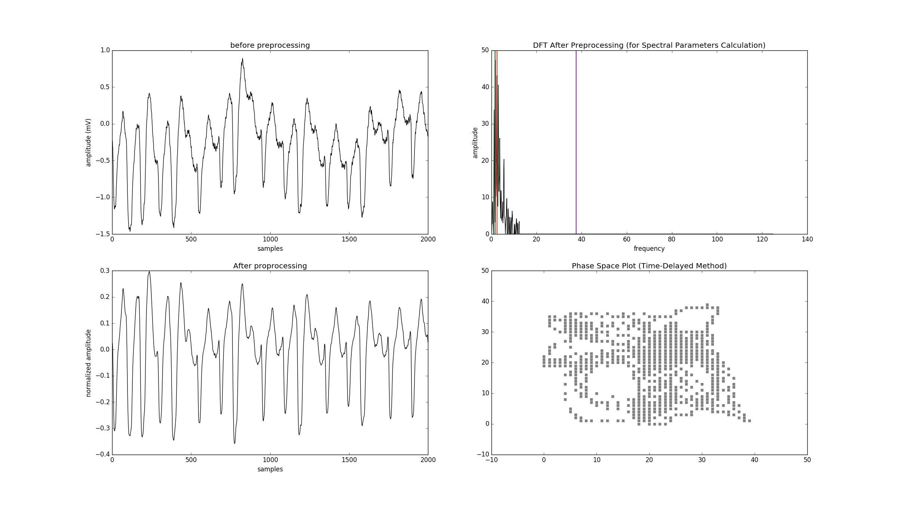

<a id="figure-41"></a>
**Figure 4.1: Severe Baseline Wander Could Break Frequency Domain Features**

Large variations in amplitudes happened when the ECG segment contained several PVCs at different points or some high spikes of artifacts. Severe baseline wander with imperfect filtering might also cause this condition. Methods relying on threshold crossing were affected by large variations in amplitudes since the threshold was either determined by a fixed percentage of the maximum or by some statistics based on the mean and standard deviation, like the auxiliary counts. To overcome this problem, when calculating these features, the average of multiple values calculated using a moving window was used, but this could not eliminate all of the errors. The Lempel-Ziv complexity feature might also be affected since the procedure converting the ECG signal to a binary sequence also relied on a threshold crossing mechanism.

Different from the case in low-frequency noise, high-frequency noise mainly affected complexity measures. When the ECG segments contained irregular high-frequency noise that could not be fully removed by the low-pass filter, both the Lempel-Ziv complexity and sample entropy might increase rapidly as these saw-tooth like noise greatly increased the irregularity of the original ECG waveform. In addition, this also affected frequency domain based methods since high-frequency noise from various sources mixed together could make the signal broad-band, mimicking the characteristics of the normal ECG signal in the frequency domain. Figure 4.2 was an example of this case.

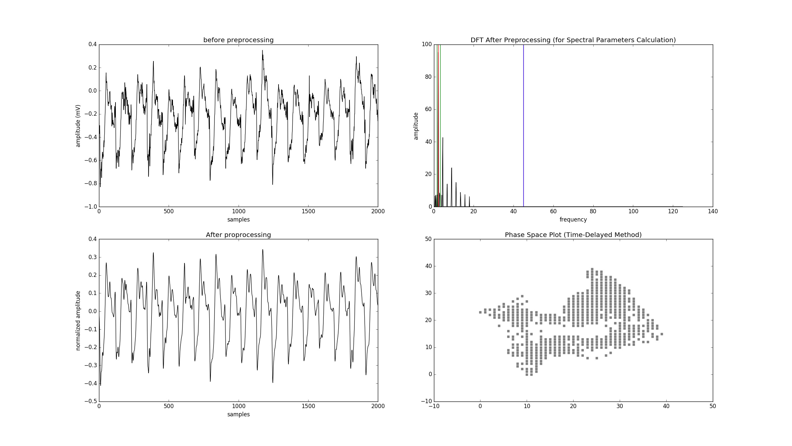

<a id="figure-42"></a>
**Figure 4.2: High-Frequency Noises Increased Randomness of the Signal and Could Make Non-shockable Rhythms Look Like VF**

On the contrary, severe high-frequency noise might also make VF mimicking NSR in the frequency domain by making it a broad-band signal as shown in Figure 4.3.

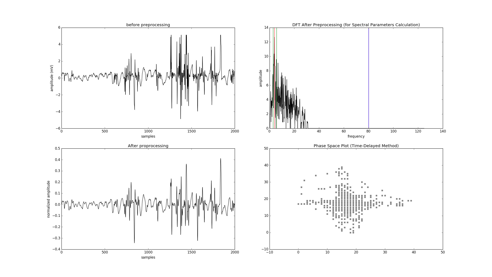

<a id="figure-43"></a>
**Figure 4.3: High-Frequency Noises and Artifacts Might Make a VF Rhythm Broad-band, Mimicking NSR in the Frequency Domain**

Though belonging to different classes, coarse VF and fine VF were merely different in their amplitudes. After normalization of the signal, there was no way to distinguish them based solely on morphology. We have included the amplitude in the feature set to capture this difference, but in some borderline cases whose amplitude were around the 0.2 mV cut-off, it could either be classified as shockable or as intermediate.

The ECG databases used in this study were also widely used in previous researches and examined by different researchers, but they were still far from perfect. During our error analysis, we found various errors in the annotations provided by these public databases. The author tried to correct part of them as stated in section 2.2.4, but doing an exhaustive search for all errors manually was not feasible given the limited resources we have. Some ECG segments with poor quality and obvious artifacts were not marked as such. For example, the record 429 in VFDB and some segments in record cu09 of CUDB had this kind of problems. Moreover, some ECG segments annotated as non-shockable rhythms actually contained VT or VF. For instance, the records 418 and 419 in VFDB were known to have errors. Figure 4.4 was an ECG segment with suspected ventricular arrhythmia from record 418 of VFDB which was annotated as NSR.

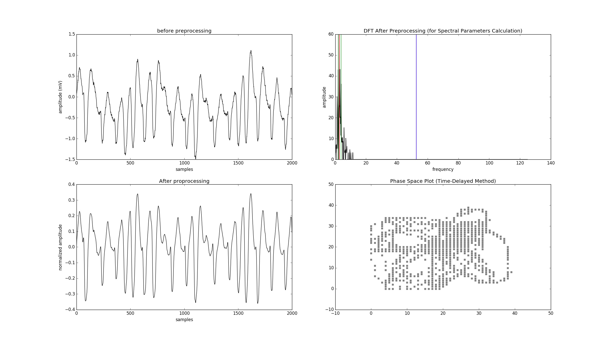

<a id="figure-44"></a>
**Figure 4.4: An ECG Segment with Ventricular Arrhythmia was Wrongly Marked as NSR in the Original Dataset**

Moreover, there were some rhythms which natively have a VF/VT-like morphology. For instance, supraventricular tachycardia (SVT) and atrial fibrillation (AF) are arrhythmias with rapid heart rates. When they coexisted with widened QRS complexes due to aberrancy of conduction, as shown in Figure 4.5, it could be hard even for human eyes to distinguish them from VT [[1](#ref-1)]. This kind of error was inevitable sometimes.

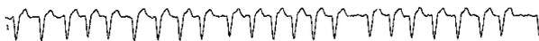

<a id="figure-45"></a>
**Figure 4.5: Atrial Fibrillation with Pre-existing Left Bundle Branch Block Might Mimic VT**

The ECG image was by courtesy of Dean Jenkins and Stephen Gerred (<http://www.ecglibrary.com/>).

### 4.1.2 Special Cases

#### Sino-atrial Block

From Table 3.1, we could see there was only one sample with this rhythm type. Further examinations of our test results revealed that the sample was only included in the test dataset in 24 % of the 100 iterations. Since it was the only one sample in this rhythm class, for the rest of 76 % iterations the specificity values for sino-atrial block was not applicable. When calculating the average specificity for it, these iterations need to be excluded and the correct average specificity became 100 %.

#### High-Grade Ventricular Ectopic Activity

In the publicly available ECG databases, there were ECG rhythm segments marked as high-grade ventricular ectopic activity. In our study, we labeled them as non-shockable rhythms. This labeling, however, has some potential problems. The Lown's grading criteria for ectopic ventricular beats appeared in 1971 as a tool to evaluate the prognosis of post-myocardial infarction patients [[34](#ref-34)]. The grading system defined six grades for classifying ventricular ectopic beats. There was no universal definition for "high-grade", but a research published in 1987 referred to Lown grade 4a, 4b, and 5 as high-grade [[46](#ref-46)]. The definition of grade 4b earlier actually corresponded to the term non-sustained VT nowadays. In other words, in these ECG segments, some actually contained episodes of VT and should be classified as intermediate rhythms instead. Due to the lack of more detailed information from the original datasets, it will require the help of cardiologists to correct these annotations manually. It was acceptable for our algorithms to make mistakes on these samples.

## 4.2 Potential Roles of Linear Models

While recent researchers seemed to focus more on powerful and complicated new machine learning approaches most of which are non-linear, we demonstrated that it was actually feasible to build a quite decent ventricular arrhythmia detection system for AED with a simple linear model. Although in our experiment settings, SVM with RBF kernel slightly outperformed the other linear models we tested in precision, it should be noted that the performance of logistic regression and linear SVM could still meet all of the requirements from the AHA yet being more efficient computation-wise. This finding might have important implications for applications of this kind of algorithms in devices without much computation power, such as the AEDs.

## 4.3 Importance of Features

We have conducted some initial analysis to evaluate the importance of each feature (data not shown). In our experiment settings, the time domain features TCSC and Count3 seemed to be the most crucial. Removing them caused a significant drop in classifier performance. The other time-domain features Count2 and TCI, different from the report of previous research by Li et al. [[33](#ref-33)], did not affect our results much. The frequency-domain feature VF leak, one of the top-ranked features in the study of Alonso-Atienza et al. [[3](#ref-3)] actually had a low weight in our model, too. These discrepancies might come from the use of different ECG datasets and the inconsistency in the classification schemes defined in these researches. Therefore it might be inappropriate to compare the performance numbers reported by different researchers directly without taking the differences of their study designs into account.

In our observation, trying to remove features with lower weights in the linear models caused a mild decrease in the performance of detecting the shockable rhythms. Hence there might still be some room for feature selection. However, the precision for detecting the intermediate rhythms dropped quickly once we started to eliminate some features. To better follow the multiclass classification recommended by the AHA, we preserved these features, resulting in a relatively higher dimensional feature vector. No further conclusion could not be made at the moment since we only did some preliminary work on this, but there seemed to be some chances to reduce the feature set with some trade-off.

## 4.4 Limitations of the Study

The author of this thesis already tried hard to improve the correctness of the dataset, the testing workflow, and the compliance of the AHA specifications for AED. However, due to the lack of some rhythm types in publicly available ECG datasets, we still had an unbalanced dataset in which the shockable and intermediate classes only composed of a small fraction. This, therefore, required careful class weighting or sample weighting during training of the machine learning classifiers. Otherwise, the prediction might easily be inclined to the negative class. In addition, the performance metric accuracy became less useful in this scenario. Because most of the samples belonged to the negative class, making errors in predicting the positive class, the shockable rhythms, did not affect the overall accuracy much. Therefore we did not report accuracy and could not use it as a measure to select the best parameters during cross-validation.

Furthermore, the AHA guideline had minimal requirements for sample numbers of some important rhythm types when testing the algorithms using an ECG dataset. Table 4.3 summarized the sample numbers and patient numbers of each rhythm class in our study.

<a id="table-43"></a>
Table 4.3: Insufficient Patient Numbers

|                                                 | Samples | Patients | AHA requirement |
|-------------------------------------------------|---------|----------|-----------------|
| Shockable                                       |         |          |                 |
| Coarse VF                                       | 746     | 42       | 200             |
| Rapid VT                                        | 75      | 10       | 50              |
| Non-shockable                                   |         |          | 300             |
| NSR                                             | 77950   | 149      | 100             |
| AF, SB, SVT, heart block, idioventricular, PVCs | 2612    | 30       | 30              |
| Intermediate                                    |         |          |                 |
| Fine VF                                         | 10      | 4        | 25              |
| Other VT                                        | 47      | 3        | 25              |

The sample numbers of the shockable, non-shockable, and intermediate rhythms included in our test dataset satisfied most of the minimal requirements of the AHA. But there were not sufficient samples for fine VF. In addition, many samples came from the same patient. If we only allowed one ECG sample per patient, then we had insufficient patient numbers according to the AHA guideline.

Although nearly all of the sample count of each rhythm class in our datasets satisfied the AHA requirements, many of the samples were from the same patients. The guideline stated that "Algorithms may examine different rhythms recorded from the same patient. However, there can be only one sample of each specific rhythm from each patient [[28](#ref-28)]. From this perspective, we had insufficient patient numbers. So, overestimation of the classification performance might be possible. Nevertheless, since VF is a disorganized and irregular rhythm without a fixed pattern, even VF segments from the same patient could look totally different. This might slightly ensure the diversity of the training and testing datasets even when some of the samples were from the same patient.

The fraction of each rhythm class in our test dataset was quite different from the distribution of different arrhythmias in real-world epidemiological data. According to the Cardiac Arrest Registry to Enhance Survival (CARES) study [[37](#ref-37)], 23.7 % of the patients with witnessed OHCA initially presented with VF or VT, but in our dataset, only 1.05 % of the samples contain VF or VT rhythms.

Last, we only tested the performance of the algorithms against artifact-free ECG segments as the AHA guideline only had performance goals for artifact-free samples. In real clinical settings, however, artifacts were not unusual. Some automatic noise detection or elimination mechanisms might be needed to improve such a system in the future.

The above problems, however, were nearly inevitable in similar academic researches in this field because of the difficulty in collecting such large number of distinct patients with so many different types of arrhythmia along with high-quality manual annotations reviewed by cardiologists.

# Chapter 5

# Conclusion

In this thesis, we demonstrated the building a machine-learning algorithm for detecting life-threatening arrhythmias. The proposed algorithm has been evaluated strictly following existing medical standards set by the AHA. This was rarely done in earlier researches in this field. The overall performance of current machine learning-based approach in this research exceeded all of the performance requirements specified by the AHA guideline. Hence the adoption of machine learning algorithms for use in AED devices looks quite promising. With the feature set we selected in this study, even a simple linear classifier could have a decent performance. It implied that the feature set has captured most of the main characteristics of VF and VT.

The impressive performance of the machine learning algorithms, nevertheless, still came at a price. Compared with the computation needed for each simple VF detection algorithm, aggregating them using a machine learning classifier requires executing all of these algorithms together and gather their results to form a multidimensional feature vector. This process could be computation intensive. Training such a machine learning classifier, as in our experiments, could be handled easily by a modern personal computer. Even if the ECG dataset becomes huge in the future, some distributed computing techniques could still be leveraged. Once the training is finished, the AEDs could directly use the trained model for prediction. However, the devices will still be responsible for performing the feature extraction in real-time. To not delay the prediction and decision making, these independent features might need to be calculated concurrently. In our experience, most of the threshold-crossing-based features were easy to calculate. With fast Fourier transform, spectral analysis was not the bottleneck, either. Some of the complexity based algorithms, however, were computation-intensive, especially the sample entropy. These computation requirements might increase the cost of the AED hardware. Thus in the future, some feature selection or dimensionality reduction techniques deserve further investigations.

Moreover, in our experiment, we took an 8-second ECG segment first, and then perform the processing. In real AEDs, it might not be desired to wait for eight seconds simply to gather the ECG signals and then wait for more seconds for feature extraction and prediction. Many features relying on a one-second or three-second moving window can be calculated along the signal recording process in parallel to decrease the waiting time. These are potential improvements that can be done in future researches.

From the perspective of a physician, the machine learning algorithm seemed to perform well in the tests. However, whether using these approaches in real clinical settings can improve patient survival or safety still requires further validations. Although we have followed the AHA medical standards as much as possible, the AHA required reporting the performance for "artifact-free" ECG samples only. In the real world, the ECG strips frequently contain noise and artifacts, especially for those recorded during the cardio-pulmonary resuscitation (CPR). To ensure the robustness of the algorithms, testing against ECG signal with noise and artifacts is warranted. Otherwise, a noise detection algorithm will need to be included in the system in the future.

As discussed in previous sections, the freely available ECG datasets widely used in ECG researches were not diverse enough and contained inadequate patient numbers for some rhythm types, had unbalanced distributions, and the quality of annotations varied. Also, the demographic data of the patients included, such as their age, gender, underlying diseases, ...etc., were not available in these databases, but the information is important when examining whether the testing environment is close to clinical setting or not. A more standard compliant ECG database recorded from actual AED devices in various clinical settings might greatly help the advances of the researches in this field. At the time of this writing, however, such a database does not exist. Therefore the author of this thesis tried to collect the best parts of existing free public ECG databases and carefully corrected some of the errors in them. We hope that our hard work could approximate a slightly more standard-compliant testing environment which might be used in future researches as a benchmark for AED algorithms, helping other researchers in this field.

# References
- <a id="ref-1"></a>[1] B. J. Aehlert. *ECGs Made Easy*. Elsevier Health Sciences, 5th edition, 2015.
- <a id="ref-2"></a>[2] F. Alonso-Atienza, E. Morgado, L. Fernández-Martínez, A. García-Alberola, and J. Rojo-Álvarez. Combination of eeg parameters with support vector machines for the detection of life-threatening arrhythmias. In *2012 Computing in Cardiology*, pages 385–388, Sept 2012.
- <a id="ref-3"></a>[3] F. Alonso-Atienza, E. Morgado, L. Fernández-Martínez, A. García-Alberola, and J. L. Rojo-Álvarez. Detection of life-threatening arrhythmias using feature selection and support vector machines. *IEEE Trans. Biomed. Eng.*, 61(3):832–840, March 2014.
- <a id="ref-4"></a>[4] Y. Alwan, Z. Cvetkovic, and M. J. Curtis. Classification of human ventricular arrhythmia in high dimensional representation spaces. *CoRR*, abs/1312.5354, 2013.
- <a id="ref-5"></a>[5] A. Amann, R. Tratnig, and K. Unterkofler. A new ventricular fibrillation detection algorithm for automated external defibrillators. In *Computers in Cardiology, 2005*, pages 559–562, Sept 2005.
- <a id="ref-6"></a>[6] A. Amann, R. Tratnig, and K. Unterkofler. Reliability of old and new ventricular fibrillation detection algorithms for automated external defibrillators. *Biomed. Eng. Online*, 4(1):1–15, 2005.
- <a id="ref-7"></a>[7] A. Amann, R. Tratnig, and K. Unterkofler. Detecting ventricular fibrillation by time-delay methods. *IEEE Trans. Biomed. Eng.*, 54(1):174–177, Jan 2007.
- <a id="ref-8"></a>[8] E. M. Anas, S. Y. Lee, and M. K. Hasan. Sequential algorithm for life threatening cardiac pathologies detection based on mean signal strength and EMD functions. *Biomed. Eng. Online*, 9:43, 2010.
- <a id="ref-9"></a>[9] M. A. Arafat, A. W. Chowdhury, and M. K. Hasan. A simple time domain algorithm for the detection of ventricular fibrillation in electrocardiogram. *SIViP*, 5(1):1–10, 2011.
- <a id="ref-10"></a>[10] S. Barro, R. Ruiz, D. Cabello, and J. Mira. Algorithmic sequential decision-making in the frequency domain for life threatening ventricular arrhythmias and imitative artefacts: a diagnostic system. *J. Biomed. Eng.*, 11(4):320 – 328, 1989.
- <a id="ref-11"></a>[11] R. H. Clayton, A. Murray, and R. W. Campbell. Recognition of ventricular fibrillation using neural networks. *Med. Biol. Eng. Comput.*, 32(2):217–220, Mar 1994.
- <a id="ref-12"></a>[12] C. Cortes and V. Vapnik. Support-vector networks. *Machine Learning*, 20(3):273–297, 1995.
- <a id="ref-13"></a>[13] T. S. Diehl, editor. *ECG interpretation made incredibly easy!* Lippincott Williams and Wilkins, 5th edition, 2011.
- <a id="ref-14"></a>[14] I. K. Duskalov, I. A. Dotsinsky, and I. I. Christov. Developments in ecg acquisition, preprocessing, parameter measurement, and recording. *IEEE Eng. Med. Biol. Mag.*, 17(2):50–58, March 1998.
- <a id="ref-15"></a>[15] R. Dzwonczyk, C. G. Brown, and H. A. Werman. The median frequency of the ecg during ventricular fibrillation: its use in an algorithm for estimating the duration of cardiac arrest. *IEEE Trans. Biomed. Eng.*, 37(6):640–646, June 1990.
- <a id="ref-16"></a>[16] M. Elgendy, B. Eskofier, S. Dokos, and D. Abbott. Revisiting qrs detection methodologies for portable, wearable, battery-operated, and wireless ecg systems. *PLoS One*, 9(1):1–18, 01 2014.
- <a id="ref-17"></a>[17] A. L. Goldberger, L. A. N. Amaral, L. Glass, J. M. Hausdorff, P. C. Ivanov, R. G. Mark, J. E. Mietus, G. B. Moody, C.-K. Peng, and H. E. Stanley. Physiobank, physiotoolkit, and physionet: Components of a new research resource for complex physiologic signals. *Circulation*, 101(23):e215–e220, 2000.
- <a id="ref-18"></a>[18] L. Goldman and A. I. Schafer, editors. *Goldman-Cecil Medicine*. Saunders, an imprint of Elsevier Inc., 25th edition, 2016.
- <a id="ref-19"></a>[19] P. S. Hamilton. E.p. limited: Open source ecg analysis software.
- <a id="ref-20"></a>[20] C.-W. Hsu and C.-J. Lin. A comparison of methods for multiclass support vector machines. *IEEE Trans. Neural Networks*, 13(2):415–425, Mar 2002.
- <a id="ref-21"></a>[21] N. E. Huang, Z. Shen, S. R. Long, M. C. Wu, H. H. Shih, Q. Zheng, N.-C. Yen, C. C. Tung, and H. H. Liu. The empirical mode decomposition and the hilbert spectrum for nonlinear and non-stationary time series analysis. *Proc. R. Soc. A*, 454(1971):903–995, 1998.
- <a id="ref-22"></a>[22] I. Jekova. Shock advisory tool: Detection of life-threatening cardiac arrhythmias and shock success prediction by means of a common parameter set. *Biomed. Signal Process. Control*, 2(1):25 – 33, 2007.
- <a id="ref-23"></a>[23] I. Jekova and V. Krasteva. Real time detection of ventricular fibrillation and tachycardia. *Physiol. Meas.*, 25(5):1167, 2004.
- <a id="ref-24"></a>[24] I. Jekova and P. Mitev. Detection of ventricular fibrillation and tachycardia from the surface ECG by a set of parameters acquired from four methods. *Physiol. Meas.*, 23(4):629–634, Nov 2002.
- <a id="ref-25"></a>[25] S. JS and M. WH. Recalls and safety alerts affecting automated external defibrillators. *JAMA*, 296(6):655–660, 2006.
- <a id="ref-26"></a>[26] V. Kalidas and L. S. Tamil. Enhancing accuracy of arrhythmia classification by combining logical and machine learning techniques. In *2015 Computing in Cardiology Conference (CinC)*, pages 733–736, Sept 2015.
- <a id="ref-27"></a>[27] J. S. Karthika, J. M. Thomas, and J. J. Kizhakkekkottam. Detection of life-threatening arrhythmias using temporal, spectral and wavelet features. In *2015 IEEE International Conference on Computational Intelligence and Computing Research (ICCIC)*, pages 1–4, Dec 2015.
- <a id="ref-28"></a>[28] R. E. Kerber, L. B. Becker, J. D. Bourland, R. O. Cummins, A. P. Hallstrom, M. B. Michos, G. Nichol, J. P. Ornato, W. H. Thies, R. D. White, B. D. Zuckerman, and M. E. by the Board of Trustees of the American College of Cardiology. Automatic external defibrillators for public access defibrillation: Recommendations for specifying and reporting arrhythmia analysis algorithm performance, incorporating new waveforms, and enhancing safety: A statement for health professionals from the american heart association task force on automatic external defibrillation, subcommittee on aed safety and efficacy. *Circulation*, 95(6):1677–1682, 1997.
- <a id="ref-29"></a>[29] S. Kuo and R. Dillman. Computer detection of ventricular fibrillation. *Proc. Computers in Cardiology*, 1978.
- <a id="ref-30"></a>[30] S.-H. Lee, K.-Y. Chung, and J. S. Lim. Detection of ventricular fibrillation using hilbert transforms, phase-space reconstruction, and time-domain analysis. *Personal Ubiquitous Comput.*, 18(6):1315–1324, Aug. 2014.
- <a id="ref-31"></a>[31] A. Lempel and J. Ziv. On the complexity of finite sequences. *IEEE Trans. Inf. Theory*, 22(1):75–81, Jan 1976.
- <a id="ref-32"></a>[32] H. Li, W. Han, C. Hu, and M. Q. H. Meng. Detecting ventricular fibrillation by fast algorithm of dynamic sample entropy. In *Robotics and Biomimetics (ROBIO), 2009 IEEE International Conference on*, pages 1105–1110, Dec 2009.
- <a id="ref-33"></a>[33] Q. Li, C. Rajagopalan, and G. D. Clifford. Ventricular fibrillation and tachycardia classification using a machine learning approach. *IEEE Trans. Biomed. Eng.*, 61(6):1607–1613, June 2014.
- <a id="ref-34"></a>[34] B. LOWN and M. WOLF. Approaches to sudden death from coronary heart disease. *Circulation*, 44(1):130–142, 1971.
- <a id="ref-35"></a>[35] T. J. Mader, B. H. Nathanson, S. Millay, R. A. Coute, M. Clapp, and B. McNally. Out-of-hospital cardiac arrest outcomes stratified by rhythm analysis. *Resuscitation*, 83(11):1358 – 1362, 2012.
- <a id="ref-36"></a>[36] C. D. Manning, P. Raghavan, and H. Schütze. *Introduction to Information Retrieval*. Cambridge University Press, New York, NY, USA, 2008.
- <a id="ref-37"></a>[37] B. McNally, R. Robb, M. Mehta, K. Vellano, A. L. Valderrama, P. W. Yoon, C. Sas-son, A. Crouch, A. B. Perez, R. Merritt, and A. Kellermann. Out-of-hospital cardiac arrest surveillance — Cardiac Arrest Registry to Enhance Survival (CARES), United States, October 1, 2005–December 31, 2010. *MMWR Surveill. Summ.*, 60(8):1–19, Jul 2011.
- <a id="ref-38"></a>[38] J. C. T. B. Moraes, M. Blechner, F. N. Vilani, and E. V. Costa. Ventricular fibrillation detection using a leakage/complexity measure method. In *Computers in Cardiology, 2002*, pages 213–216, Sept 2002.
- <a id="ref-39"></a>[39] A. Neurauter, T. Eftestøl, J. Kramer-Johansen, B. S. Abella, K. Sunde, V. Wenzel, K. H. Lindner, J. Eilevstjønn, H. Myklebust, P. A. Steen, and H. U. Strohmenger. Prediction of countershock success using single features from multiple ventricular fibrillation frequency bands and feature combinations using neural networks. *Resuscitation*, 73(2):253–263, May 2007.
- <a id="ref-40"></a>[40] T. Nishiyama, A. Nishiyama, M. Negishi, S. Kashimura, Y. Katsumata, T. Kimura, N. Nishiyama, Y. Tanimoto, Y. Aizawa, H. Mitamura, K. Fukuda, and S. Takatsuki. Diagnostic accuracy of commercially available automated external defibrillators. *J. Am. Heart. Assoc.*, 4(12), 2015.
- <a id="ref-41"></a>[41] J. Pardey. Detection of ventricular fibrillation by sequential hypothesis testing of binary sequences. In *2007 Computers in Cardiology*, pages 573–576, Sept 2007.
- <a id="ref-42"></a>[42] S. M. Pincus. Approximate entropy as a measure of system complexity. *Proc. Natl. Acad. Sci. U.S.A.*, 88(6):2297–2301, Mar 1991.
- <a id="ref-43"></a>[43] M. Sansone, R. Fusco, A. Pepino, and C. Sansone. Electrocardiogram pattern recognition and analysis based on artificial neural networks and support vector machines: a review. *J Healthc Eng*, 4(4):465–504, 2013.
- <a id="ref-44"></a>[44] N. V. Thakor, Y. S. Zhu, and K. Y. Pan. Ventricular tachycardia and fibrillation detection by a sequential hypothesis testing algorithm. *IEEE Trans. Biomed. Eng.*, 37(9):837–843, Sept 1990.
- <a id="ref-45"></a>[45] The Public Access Defibrillation Trial Investigators. Public-access defibrillation and survival after out-of-hospital cardiac arrest. *N. Engl. J. Med.*, 351(7):637–646, 2004. PMID: 15306665.
- <a id="ref-46"></a>[46] C. M. Tracy, J. Winkler, E. Brittain, M. B. Leon, S. E. Epstein, and R. O. Bonow. Determinants of ventricular arrhythmias in mildly symptomatic patients with coronary artery disease and influence of inducible left ventricular dysfunction on arrhythmia frequency. *J. Am. Coll. Cardiol.*, 9(3):483–488, 1987.
- <a id="ref-47"></a>[47] M. L. Weisfeldt, C. M. Sitlani, J. P. Ornato, T. Rea, T. P. Aufderheide, D. Davis, J. Dreyer, E. P. Hess, J. Jui, J. Maloney, G. Sopko, J. Powell, G. Nichol, and L. J. Morrison. Survival after application of automatic external defibrillators before arrival of the emergency medical system: Evaluation in the resuscitation outcomes consortium population of 21 million. *J. Am. Coll. Cardiol.*, 55(16):1713 – 1720, 2010.
- <a id="ref-48"></a>[48] D. Xia, Q. Meng, Y. Chen, and Z. Zhang. *Classification of Ventricular Tachycardia and Fibrillation Based on the Lempel-Ziv Complexity and EMD*, pages 322–329. Springer International Publishing, Cham, 2014.
- <a id="ref-49"></a>[49] X. S. Zhang, Y. S. Zhu, N. V. Thakor, and Z. Z. Wang. Detecting ventricular tachycardia and fibrillation by complexity measure. *IEEE Trans. Biomed. Eng.*, 46(5):548–555, May 1999.
- <a id="ref-50"></a>[50] Z.-X. Zhang, S.-H. Lee, and J. S. Lim. *Discrimination of Ventricular Arrhythmias Using NEWFM*, pages 176–183. Springer Berlin Heidelberg, Berlin, Heidelberg, 2008.
