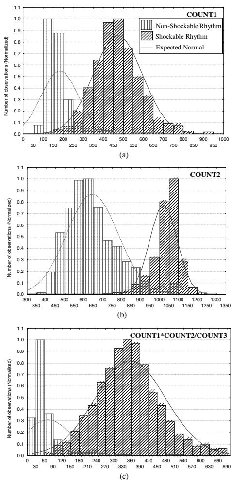
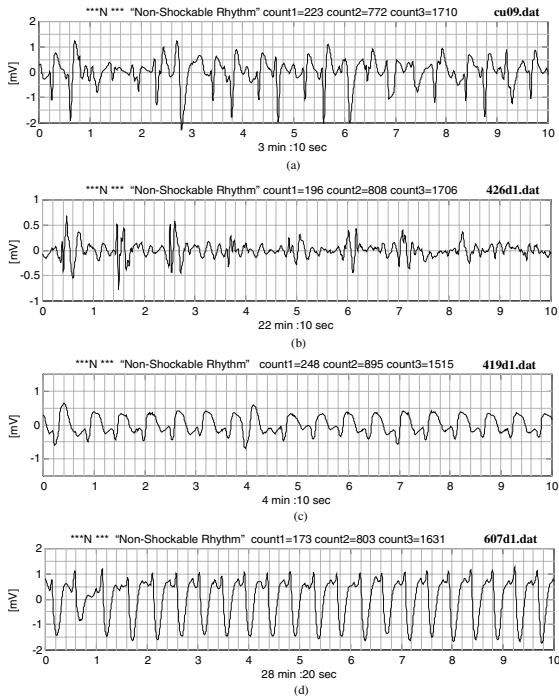

# Real time detection of ventricular fibrillation and tachycardia

Irena Jekova and Vessela Krasteva

Centre of Biomedical Engineering, Bulgarian Academy of Sciences,  
Acad. G. Bonchev str. bl. 105, 1113 Sofia, Bulgaria

E-mail: irena@clbme.bas.bg and vessika@clbme.bas.bg

Received 23 January 2004, accepted for publication 8 June 2004

Published 6 August 2004

Online at [stacks.iop.org/PM/25/1167](http://stacks.iop.org/PM/25/1167)

doi:10.1088/0967-3334/25/5/007

## Abstract

The automatic external defibrillator (AED) is a lifesaving device, which processes and analyses the electrocardiogram (ECG) and delivers a defibrillation shock to terminate ventricular fibrillation or tachycardia above 180 bpm. The built-in algorithm for ECG analysis has to discriminate between shockable and non-shockable rhythms and its accuracy, represented by sensitivity and specificity, is aimed at approaching the maximum values of 100%. An algorithm for VF/VT detection is proposed using a band-pass digital filter with integer coefficients, which is very simple to implement in real-time operation. A branch for wave detection is activated for heart rate measurement and an auxiliary parameter calculation. The method was tested with ECG records from the widely recognized databases of the American Heart Association (AHA) and the Massachusetts Institute of Technology (MIT). A sensitivity of 95.93% and a specificity of 94.38% were obtained.

**Keywords:** ventricular fibrillation detection, external electrocardiogram, sensitivity, specificity

## 1. Introduction

Ventricular fibrillation (VF) and ventricular tachycardia (VT) of a rate above 180 beats  $\text{min}^{-1}$  are dangerous cardiac disturbances, which may lead to hypoxic brain injury and death if no defibrillation shock is applied within a few minutes. Critical cardiac incidents occur most often out of hospitals, therefore automatic external defibrillators (AED) were introduced for increasing the survival rate (Kerber *et al* 1997). Their purpose is to recognize and treat ventricular fibrillation and tachycardia above 180 bpm without the need for interpretation of the electrocardiogram (ECG) by qualified medical personnel. Since the successful termination

of VF and VT requires fast response and application of high-energy shocks in the heart region, the very high accuracy of the built-in algorithm for VF detection is of great importance. Therefore the automated diagnosis must match the accuracy of specialists.

Reliable and accurate detection of VF from a single-lead external ECG is a difficult task. Time and frequency domain analyses have been applied, e.g. Clayton *et al* (1993), Jekova (2000) and Jekova *et al* (2001). The use of more complicated methods, such as nonlinear analysis, was also attempted (Kaplan and Cohen 1990, Denton 1992). Recently, Clayton and Murray (1999) reconsidered the nonlinear aspect of fibrillation. However, these methods are computationally demanding and still difficult to implement in real-time operating devices.

Aiming at a simple solution, convenient for embedding in an AED microprocessor system, therefore operating in real time, we developed an algorithm for VF/VT detection based on a band-pass digital filter, whose output signal is subjected to specific analysis. The filter could also be implemented as a simple second-order band-pass circuit with operational amplifiers. However, we preferred to use a digital filter with integer coefficients. A branch of the algorithm, activated under pre-set conditions, is dedicated to heart rate measurement.

## 2. Material and method

### 2.1. ECG signals

We used 99 full-length ECG signal recording files, all containing non-shockable rhythms. Ninety three of all 99 files (96%) included shockable rhythm episodes. The dataset consisted of 30 min two-channel AHA VF database (A8001–A8010) and MIT database files (the latter including the 8 min single-channel *cudb* and the 35 min two-channel *vfdb* records). A total of 9726 non-shockable and 2528 shockable 10 s episodes were thus collected. All signals are sampled at 250 Hz, 12-bit resolution.

The non-shockable dataset included the following types of signals:

- normal sinus rhythms—80 files (20 *AHA* files from 10 patients, 40 *vfdb* files from 15 patients and 20 *cudb* files from 20 patients);
- branch blocks—13 files (10 *vfdb* files from 4 patients and 3 *cudb* files from 3 patients);
- bradycardia—4 *AHA* files from 2 patients;
- ECG with paced beats—5 files (2 *AHA* files from 1 patient, 2 *vfdb* files from 1 patient and 1 *cudb* file);
- ECGs with ectopic beats—6 files (2 *AHA* files from 1 patient and 4 *vfdb* files from 2 patients);
- supraventricular tachycardia—2 *vfdb* files from 1 patient;
- bigeminy—5 files (2 *AHA* files from 1 patient, 2 *vfdb* files from 1 patient and 1 *cudb* file);
- trigeminy—1 *cudb* file;
- low amplitude ECGs—3 *vfdb* signals from 2 patients;
- non-shockable VTs below 180 bpm—16 files (2 *AHA* files from 1 patient, 8 *vfdb* files from 4 patients and 6 *cudb* files from 6 patients);
- noise contaminated signals—(5 *AHA* files from 3 patients, 16 *vfdb* files from 8 patients and 21 *cudb* files from 21 patients).

The shockable dataset included

- VF signals—80 files (20 *AHA* files from 10 patients, 38 *vfdb* files from 14 patients and 35 *cudb* files from 35 patients). Here are included only 2 files, containing agonal rhythms from 1 patient (A8010);

- VT signals of rates above 180 bpm—11 files (6 *vfdb* files from 3 patients and 5 *cudb* files from 5 patients).

Each 10 s epoch of all above-described records was annotated by an experienced cardiologist and a biomedical engineer and labelled as 'non-shockable', 'shockable', 'asystoly' and 'noise'.

### 2.2. Algorithm

The analysis was applied on subsequent 10 s epochs. The general flow chart of the algorithm is presented in figure 1. All analysis and test procedures were performed with the software package MATLAB 6.0 (MathWorks, Inc.).

**2.2.1. Signal preprocessing filtration.** The applied signal preprocessing included (i) two successive first-order high-pass filters with 1 Hz cut-off frequency to suppress residual baseline drift; (ii) a second-order 30 Hz Butterworth low-pass filter to reduce muscle noise, following the approach of Thakor *et al* (1990) and (iii) a notch filter to eliminate powerline interference. The equivalent high-pass filter cut-off frequency of 1.4 Hz is slightly higher than the accepted bandwidth (0.67–30 Hz) for 'monitor' type ECG (IEC 62D/60601-2-27 1994). As for defibrillator monitors there is no strictly specified bandwidth (IEC Committee Draft 2001), practically a relatively high-frequency cut-off, up to 2 Hz is acceptable, since it does not attenuate VF or VT signals (Charbonnier 1994). In addition, this brought the advantage of faster recovery after high-amplitude noise and a defibrillation pulse artefact, as well as better suppression of residual baseline drift.

**2.2.2. Noise and asystoly detection.** The first step of the algorithm is noise detection. It makes use of criteria for detection of abnormal signal amplitudes and slopes, uncharacteristic for ECG signals. The amplitude threshold is chosen according to the dynamic range of the input amplifiers and analogue to digital (AD) converter to detect extreme artefacts (for example AD converter saturation). The maximum slew rate limit above which a signal is considered 'noise' was set at  $400 \mu\text{V ms}^{-1}$ .

Signals with amplitudes below  $150 \mu\text{V}$  are not analysed and classified as 'Asystoly'.

**2.2.3. Band-pass digital filtration.** The VF/VT detection method uses a band-pass digital filter to pass the supraventricular complexes (normal sinus rhythm, atrial tachycardia, atrial fibrillation, atrial flutter and sinus tachycardia) and ventricular complexes (premature ventricular contractions and ventricular tachycardia) with frequencies up to 20 Hz and 14 Hz respectively (Minami *et al* 1999). The filter has to suppress the ventricular fibrillation and ventricular flutter peaks with frequency components below 7 Hz, according to Murray *et al* (1985) and Clayton *et al* (1994), and less than 10 Hz, after Minami *et al* (1999). Therefore, one can consider that the frequency range between 13 and 17 Hz contains the frequency components of the non-shockable rhythm complexes and almost does not contain frequency components of the shockable rhythms. Accordingly, we selected a central frequency at 15 Hz with  $\pm 2$  Hz bandwidth and designed a recursive filter with floating point precision coefficients. Aiming at a simpler solution, convenient for embedding in an AED microprocessor system, we preferred to use a digital filter with integer coefficients. A recursive filter with central frequency at 14.6 Hz and bandwidth from 13 Hz to 16.5 Hz ( $-3$  dB) was obtained by reducing

![Flow chart of the algorithm for ECG rhythm classification. The process starts with ECG Databases (AHA & MIT) 10 s time epochs. It then proceeds through signal preprocessing filtration (1.4 Hz -Highpass; 30Hz - Lowpass; 50Hz - Notch Filter). Noise Detection is performed; if Yes, it's Noise; if No, it checks Max(SignalAmplitude) < 150 uV. If Yes, it's Asystoly; if No, it goes to Band-pass digital filtration with integer coefficients (Central Frequency 14.6 Hz, bandwidth: 13 Hz -16.5 Hz)). The absolute value of the signal is calculated, and parameters Count1, Count2, Count3 are calculated. A series of decision diamonds check conditions on these counts to classify the rhythm as Non Shockable Rhythm, Shockable Rhythm, or Not Classified Rhythm. The Not Classified Rhythm path leads to 'Detection of signal waves. Calculation of parameter 'Period''. This leads to two more decision diamonds: 'Not detected waves for the last 5s' (Yes leads to Asystoly, No leads to Period < 180bpm) and 'Period < 180bpm' (Yes leads to Non-Shockable Rhythm, No leads to Shockable Rhythm).](images/fig1_flow_chart.jpg)

```

graph TD
    Start[ECG Databases (AHA & MIT)  
10 s time epochs] --> S1[Signal preprocessing filtration  
1.4 Hz -Highpass; 30Hz - Lowpass; 50Hz - Notch Filter]
    S1 --> D1{Noise Detection}
    D1 -- Yes --> Noise[Noise]
    D1 -- No --> D2{Max(SignalAmplitude) < 150 uV}
    D2 -- Yes --> Asystoly[Asystoly]
    D2 -- No --> S2[Band-pass digital filtration with integer coefficients  
(Central Frequency 14.6 Hz, bandwidth: 13 Hz -16.5 Hz)]
    S2 --> S3[Absolute value of the signal]
    S3 --> S4[Calculation of parameters:  
Count1, Count2, Count3]
    S4 --> D3{Count1 < 250 and Count2 > 950 and  
Count1 * Count2 / Count3 < 210}
    D3 -- Yes --> NSR[Non Shockable Rhythm]
    D3 -- No --> D4{250 <= Count1 < 400 and Count2 < 600 and  
Count1 * Count2 / Count3 < 210}
    D4 -- Yes --> NSR
    D4 -- No --> D5{Count1 >= 250 and Count2 > 950}
    D5 -- Yes --> SR[Shockable Rhythm]
    D5 -- No --> D6{Count2 >= 1100}
    D6 -- Yes --> SR
    D6 -- No --> NCR[Not Classified Rhythm]
    NCR --> S5[Detection of signal waves. Calculation of parameter 'Period']
    S5 --> D7{Not detected waves for the last 5s}
    D7 -- Yes --> Asystoly
    D7 -- No --> D8{Period < 180bpm}
    D8 -- Yes --> NSR2[Non-Shockable Rhythm]
    D8 -- No --> SR2[Shockable Rhythm]
  
```

Flow chart of the algorithm for ECG rhythm classification. The process starts with ECG Databases (AHA & MIT) 10 s time epochs. It then proceeds through signal preprocessing filtration (1.4 Hz -Highpass; 30Hz - Lowpass; 50Hz - Notch Filter). Noise Detection is performed; if Yes, it's Noise; if No, it checks Max(SignalAmplitude) < 150 uV. If Yes, it's Asystoly; if No, it goes to Band-pass digital filtration with integer coefficients (Central Frequency 14.6 Hz, bandwidth: 13 Hz -16.5 Hz)). The absolute value of the signal is calculated, and parameters Count1, Count2, Count3 are calculated. A series of decision diamonds check conditions on these counts to classify the rhythm as Non Shockable Rhythm, Shockable Rhythm, or Not Classified Rhythm. The Not Classified Rhythm path leads to 'Detection of signal waves. Calculation of parameter 'Period''. This leads to two more decision diamonds: 'Not detected waves for the last 5s' (Yes leads to Asystoly, No leads to Period < 180bpm) and 'Period < 180bpm' (Yes leads to Non-Shockable Rhythm, No leads to Shockable Rhythm).

Figure 1. Flow chart of the algorithm.

the floating point coefficients to integer coefficients. The filter equation (1), valid for 250 Hz sampling frequency, was designed in consideration of its future real-time implementation:

$$FS_i = \frac{14FS_{i-1} - 7FS_{i-2} + \frac{S_i - S_{i-2}}{2}}{8}. \quad (1)$$

Here  $S_i$  is a signal sample with index  $i$ ;  $FS_i$  is the filtered signal sample with index  $i$ .

The amplitude–frequency characteristic of the proposed digital integer-coefficients filter is shown in figure 2.


Figure 2: Amplitude-frequency characteristic of the digital integer-coefficient filter. The graph shows Magnitude Squared on the y-axis (ranging from 0 to 1) versus Frequency (Hz) on the x-axis (ranging from 0 to 50). The curve is a bell-shaped resonance peak centered at 14.6 Hz, reaching a maximum magnitude squared of 1.0. The bandwidth is 13 to 16.5 Hz, and the filter has a -3 dB characteristic.

**Figure 2.** Amplitude–frequency characteristic of the digital integer-coefficient filter (central frequency 14.6 Hz, bandwidth 13 to 16.5 Hz,  $-3$  dB).

**2.2.4. Rhythm classification by means of parameters *Count1*, *Count2* and *Count3*.** Three parameters are calculated from the absolute values of the digital integer-coefficients filter output (*AbsFS*), named *Count1*, *Count2* and *Count3*. Each parameter represents the number of signal samples with amplitude values within a certain amplitude range, calculated for every 10 s time interval. The respective *Count* ranges were defined as follows:

- *Count1*—Range:  $0.5 \cdot \max(\text{AbsFS})$  to  $\max(\text{AbsFS})$ ;
- *Count2*—Range:  $\text{mean}(\text{AbsFS})$  to  $\max(\text{AbsFS})$ ;
- *Count3*—Range:  $\text{mean}(\text{AbsFS}) - MD$  to  $\text{mean}(\text{AbsFS}) + MD$ ,

where  $\max(\text{AbsFS})$ ,  $\text{mean}(\text{AbsFS})$  and *MD* (mean deviation) are computed for every 1 s time interval.

We defined several conditions for classification of the ECG rhythm type, shown in the algorithm block-diagram (figure 1):

- If  $\text{Count1} < 250$  and  $\text{Count2} > 950$  and  $\text{Count1} \cdot \text{Count2} / \text{Count3} < 210$  the rhythm is classified as non-shockable.
- If  $250 \leq \text{Count1} < 400$  and  $\text{Count2} < 600$  and  $\text{Count1} \cdot \text{Count2} / \text{Count3} < 210$  the rhythm is classified as non-shockable.
- If  $\text{Count1} \geq 250$  and  $\text{Count2} > 950$  the rhythm is classified as shockable.
- If  $\text{Count2} \geq 1100$  the rhythm is classified as shockable.

The values of the thresholds for *Count1* (250 and 400), *Count2* (600, 950 and 1100) and  $\text{Count1} \cdot \text{Count2} / \text{Count3}$  (210) are chosen by descriptive statistical analysis of the *Count* values distributions, as shown below in section 3, followed by iterative testing of the detection accuracy and adjusting the threshold values. The latter is performed on the most complicated borderline cases: blocks and VT below 180 bpm for non-shockable rhythms; low-frequency VF below 3 Hz and VT above 180 bpm for shockable rhythms. The output statements are ‘Non-shockable’, ‘Shockable’ and ‘Not classified’ rhythms.

**2.2.5. Classification of the ‘Not classified’ rhythms by means of parameter *Period*.** The analysis of the ‘Not classified’ rhythms is performed on the ECG signal passed through preprocessing filtration. A parameter, named *Period*, is derived by detection of signal waves in each 10 s time interval. A brief description of the developed wave detection method follows. Initially, the first ECG signal positive or negative peak, exceeding a positive or negative threshold is looked for. At the beginning the threshold is  $\pm 150 \mu\text{V}$ . After a peak is found, the threshold becomes  $0.25 \cdot \text{Positive peak amplitude}$  or  $150 \mu\text{V}$ , whichever is higher, for a positive peak. For a negative peak, the opposite is valid ( $0.25 \cdot \text{Negative peak amplitude}$ ).

or  $-150 \mu\text{V}$ , whichever is lower). The threshold value is refreshed after every detected peak.

Suppose we have found a positive peak (for a negative peak the procedure is the same). Then we look for a second peak. If it is negative and is closer than 1 s to the positive one, we have detected one half-wave. If the second peak is again positive (meaning that the following negative peak was small—above the negative threshold), we accept the higher of them and continue to search for a negative peak. If the detected new peak (positive or negative) is closer than 0.1 s to the previous one of the same polarity, the smaller one (in absolute value) is ignored. Thus we detect all half-waves by their validated positive and negative peaks. After detecting all wave peaks, we calculate the mean amplitude value of all positive peaks (*MPP*) and do the same for the negative peaks (*MNP*). The peaks involved in computation of the higher of *MPP* or *MNP* are taken for further processing.

If the amplitudes of more than 87.5% of the peaks are in the range 75% to 125% of the respective mean value (*MPP* or *MNP*), we calculate *Period* by dividing the length of the processed signal (i.e. the 10 s time interval) by the number of detected waves. Otherwise *Period* is calculated from the equation proposed by Kuo and Dillman (1978):

$$\text{Period} = 2\pi \frac{\sum_{i=1}^m |S_i|}{\sum_{i=2}^m |S_i - S_{i-1}|}. \quad (2)$$

Here  $S_i$  is a signal sample with index  $i$  and  $m$  is the number of samples in one analysed 10 s data segment.

- The output statements of the wave analysis part of the algorithm (see figure 1) are
- ‘Asystoly’—when no waves were detected for the last 5 s of the analysed 10 s interval;
  - ‘Non-shockable’ rhythm—when heart rate, expressed by *Period*, is below 180 bpm;
  - ‘Shockable’ rhythm—when *Period* yields heart rate above 180 bpm.

## 3. Results

The *Count* values depend on the rhythm type. This can be observed in the examples of figure 3. The filter output for a ‘non-shockable’ normal sinus rhythm ECG signal (figure 3(a)) shows well-defined peaks (figure 3(b)). Thus a comparatively small number of signal samples enter the ranges defined for *Count1* and *Count2*. Conversely, a relatively higher number of samples falls in the range defined as the median deviation around the mean value of the signal, resulting in high *Count3* value.

The second example is a fibrillation signal, shown in figure 3(c). The absolute value of the filter output (figure 3(d)) appears as a signal without expressed peaks. It is associated with a higher number of samples in the range of *Count1* and *Count2*. The samples’ median deviation is lower, thus *Count3* decreases for fibrillation signals.

The distributions of the three parameters (*Count1*, *Count2* and *Count1\*Count2/Count3*) for shockable and non-shockable rhythms, according to the experts’ annotations, are shown in figures 4(a)–(c). The parameters were calculated for each 10 s ECG segment. The real and the corresponding expected normal distributions were obtained using the software package STATISTICA (StatSoft, Inc.).

The detection accuracy of the algorithm for all signals of the above-cited databases is presented in table 1. The sensitivity and specificity of the algorithm are calculated separately for each database.

Figures 5, 6 and 7 show examples of correctly detected non-shockable rhythms, correctly detected ventricular fibrillations and erroneous detections respectively. The experts’ annotation

![Figure 3: Four subplots (a, b, c, d) showing ECG signals and their digital integer-coefficient filter outputs. (a) A non-shockable ECG rhythm with regular QRS complexes. (b) Absolute value of the filter output for (a), showing peaks corresponding to QRS complexes. (c) A fibrillation signal with irregular, high-frequency oscillations. (d) Absolute value of the filter output for (c), showing a noisy signal. All plots have 'Time [s]' on the x-axis (0 to 10) and 'mV' on the y-axis. A legend box at the bottom defines the horizontal lines: solid line for mean value (threshold for Count2), dotted line for 0.5*Max value (threshold for Count1), and dashed line for Mean ± Mean deviation (range for Count3).](images/fig3_subplots.jpg)

Figure 3: Four subplots (a, b, c, d) showing ECG signals and their digital integer-coefficient filter outputs. (a) A non-shockable ECG rhythm with regular QRS complexes. (b) Absolute value of the filter output for (a), showing peaks corresponding to QRS complexes. (c) A fibrillation signal with irregular, high-frequency oscillations. (d) Absolute value of the filter output for (c), showing a noisy signal. All plots have 'Time [s]' on the x-axis (0 to 10) and 'mV' on the y-axis. A legend box at the bottom defines the horizontal lines: solid line for mean value (threshold for Count2), dotted line for 0.5\*Max value (threshold for Count1), and dashed line for Mean ± Mean deviation (range for Count3).

**Figure 3.** (a) A non-shockable ECG rhythm; (b) absolute value of the digital integer-coefficients filter output for the signal in (a). The corresponding *Count* thresholds are shown as horizontal bold lines; (c) a fibrillation signal; (d) absolute value of the digital integer-coefficient filter output for the signal in (c), with the corresponding *Count* thresholds shown as horizontal bold lines.

**Table 1.** Detection accuracy of the algorithm for signals from AHA and MIT databases. *N* is the number of 10 s ECG time intervals (epochs) from the respective database, annotated as 'non-shockable'. Correct *N* is the number of 10 s ECG epochs correctly classified by the algorithm as 'non-shockable'. *S* is the number of 10 s ECG epochs from the respective database, annotated as 'shockable'. Correct *S* is the number of 10 s ECG epochs correctly classified by the algorithm as 'shockable'. Se[%] and Sp[%] are the sensitivity and specificity of the algorithm.

| Database            | <i>N</i> | Correct <i>N</i> | <i>S</i> | Correct <i>S</i> | Sp[%] | Se[%] |
|---------------------|----------|------------------|----------|------------------|-------|-------|
| AHA                 | 2366     | 2315             | 1013     | 985              | 97.84 | 97.24 |
| MIT ( <i>yfdb</i> ) | 6159     | 5736             | 1208     | 1160             | 93.13 | 96.03 |
| MIT ( <i>cudb</i> ) | 1201     | 1128             | 307      | 280              | 93.92 | 91.21 |
| Total databases     | 9726     | 9179             | 2528     | 2425             | 94.38 | 95.93 |

for each 10 s time epoch is shown as \*\*\*N\*\*\* for non-shockable rhythm and \*\*\*S\*\*\* for shockable rhythm. The following text string is the output algorithm message, including the values of *Count1*, *Count2* and *Count3*.



Figure 4 consists of three subplots, (a), (b), and (c), each showing a histogram of normalized observations. The y-axis for all plots is 'Number of observations (Normalized)' ranging from 0.0 to 1.1. The x-axis represents the parameter values.

- (a) COUNT1:** The x-axis ranges from 0 to 1000. The 'Non-Shockable Rhythm' (white bars) is centered around 150. The 'Shockable Rhythm' (hatched bars) is centered around 450. The 'Expected Normal' (dotted line) is centered around 150.
- (b) COUNT2:** The x-axis ranges from 300 to 1350. The 'Non-Shockable Rhythm' (white bars) is centered around 600. The 'Shockable Rhythm' (hatched bars) is centered around 1050. The 'Expected Normal' (dotted line) is centered around 600.
- (c) COUNT1\*COUNT2/COUNT3:** The x-axis ranges from 0 to 690. The 'Non-Shockable Rhythm' (white bars) is centered around 30. The 'Shockable Rhythm' (hatched bars) is centered around 360. The 'Expected Normal' (dotted line) is centered around 30.

Legend for all plots:

- Non-Shockable Rhythm (White bars)
- Shockable Rhythm (Hatched bars)
- Expected Normal (Dotted line)

Figure 4: Three histograms (a, b, c) comparing observed distributions for non-shockable and shockable rhythms against expected normal distributions. (a) COUNT1, (b) COUNT2, (c) COUNT1\*COUNT2/COUNT3.

**Figure 4.** The real and the corresponding expected normal distributions of the parameters *Count1* (a), *Count2* (b) and  $\text{Count1} \cdot \text{Count2} / \text{Count3}$  (c), for shockable and non-shockable rhythms.



Figure 5 displays four examples of correctly detected non-shockable ECG signals, each showing a 10-second segment of the waveform (labeled '10 sec' on the x-axis) with a time scale from 0 to 10 minutes.

- (a) **cu09.dat**: Title: \*\*\*N \*\*\* "Non-Shockable Rhythm" count1=223 count2=772 count3=1710. The x-axis is labeled '3 min :10 sec'. The y-axis is labeled '[mV]' and ranges from -2 to 2.
- (b) **426d1.dat**: Title: \*\*\*N \*\*\* "Non-Shockable Rhythm" count1=196 count2=808 count3=1706. The x-axis is labeled '22 min :10 sec'. The y-axis is labeled '[mV]' and ranges from -1 to 1.
- (c) **419d1.dat**: Title: \*\*\*N \*\*\* "Non-Shockable Rhythm" count1=248 count2=895 count3=1515. The x-axis is labeled '4 min :10 sec'. The y-axis is labeled '[mV]' and ranges from -1 to 1.
- (d) **607d1.dat**: Title: \*\*\*N \*\*\* "Non-Shockable Rhythm" count1=173 count2=803 count3=1631. The x-axis is labeled '28 min :20 sec'. The y-axis is labeled '[mV]' and ranges from -2 to 2.

Figure 5: Examples of correctly detected non-shockable ECG signals. The figure consists of four subplots (a, b, c, d) showing ECG waveforms over time. Each plot includes a title with counts and a file name.

Figure 5. Examples of correctly detected non-shockable ECG signals.

## 4. Discussion

The main limitation of our study is the retrospective choice of thresholds, by including the entire dataset described in section 2.1. However, the larger number of observations used could be considered a positive point, enhancing the statistical significance of the results.

A truly realistic assessment of the algorithm performance can be obtained by considering some examples of difficult for classification signals. Two 'difficult' non-shockable rhythms from the MIT *cudb* and *vfdb* files are shown in figures 5(a) and (b). An example of branch block ECG from the *vfdb* database is given in figure 5(c). Figure 5(d) shows a VT case of rate below 180 bpm from a *vfdb* file. These signals were correctly detected as non-shockable.

Two shockable rhythms from the *cudb*, shown in figures 6(a) and (b) were correctly classified, in spite of the expressed amplitude modulation in the first trace and the artefacts in the second trace. However, there are records where correct classification failed. An example

![Figure 6: Examples of correctly detected ventricular fibrillations. (a) Plot of signal [mV] vs time (0 to 10 min) for file cu01.dat, showing a 'Shockable Rhythm' with counts: count1=638, count2=1109, count3=1327. (b) Plot of signal [mV] vs time (0 to 10 min) for file cu09.dat, showing a 'Shockable Rhythm' with counts: count1=490, count2=1026, count3=1450. Both plots show a noisy signal with a prominent peak around 5 minutes.](images/fig6_examples.jpg)

Figure 6: Examples of correctly detected ventricular fibrillations. (a) Plot of signal [mV] vs time (0 to 10 min) for file cu01.dat, showing a 'Shockable Rhythm' with counts: count1=638, count2=1109, count3=1327. (b) Plot of signal [mV] vs time (0 to 10 min) for file cu09.dat, showing a 'Shockable Rhythm' with counts: count1=490, count2=1026, count3=1450. Both plots show a noisy signal with a prominent peak around 5 minutes.

Figure 6. Examples of correctly detected ventricular fibrillations.

of a signal similar to atrial fibrillation but with bizarre ventricular complexes, which might be paced beats, is shown in figure 7(a)—a *vfdb* file. There are virtually no ventricular complexes between the 4th and 8th s, which disturbed the wave detection branch of the algorithm. Unfortunately, detected valid waves in this signal were more than 40, resulting in a rate above 240 bpm. Thus the signal was erroneously classified as shockable. Obviously, recognition of signals of this kind is a challenge to the algorithm that should be dealt with in further studies.

Another example of erroneous detection is shown in figure 7(b). This is a VF record from a *cudb* file. The error is due to the appearance of peak-like artefacts. They contribute to decreasing of *Count1* and *Count2* values and increasing *Count3*, resulting in non-shockable rhythm classification. It is evident that the algorithm is sensitive to peak-like artefacts appearing in fibrillation episodes. For example, a functioning pacemaker over a low-amplitude fibrillation signal would present a problem—figure 7(c). However, pacing pulse artefacts should be detected and suppressed by separate hardware and software means.

Figure 7(d) represents a very low frequency VF, which was analysed after activation of the algorithm wave detection branch. The rhythm was erroneously classified as non-shockable, due to the low fibrillation frequency (about 2 Hz).

As seen from the results in table 1, the lowest detection accuracy was obtained with the *cudb* files. These files are very short (8 min 20 s), while the AHA and *vfdb* records are of 30 and 35 min duration, respectively. Therefore, even short duration artefacts or erroneous detection episodes (mainly in some cases of branch blocks) result in a lower percentage of correct classification.

The algorithm sensitivity of 95.93% and specificity of 94.38% are comparable with those published by other authors. For example the authors of threshold crossing intervals (TCI) (Thakor *et al* 1990), auto-correlation function (ACF) (Chen *et al* 1987), VF-filter (Kuo and Dillman 1978), spectrum analysis methods (Barro *et al* 1989) and complexity measurement method for SR, VF and VT detection (Zhang *et al* 1999) reported sensitivity and specificity above 97%, obtained on segments from their own databases. The number of test segments in all studies was significantly smaller compared to the number of test segments

![Figure 7: Four ECG signal plots (a, b, c, d) showing erroneous detections. (a) 'Frequency - Shockable Rhythm' (426d1.dat) shows a non-shockable rhythm with a count of 267, 800, 1697 over 22 min :0 sec. (b) 'Non-Shockable Rhythm' (cu30.dat) shows a non-shockable rhythm with a count of 228, 914, 1568 over 1 min :10 sec. (c) 'Frequency - Non-Shockable Rhythm' (602d1.dat) shows a non-shockable rhythm with a count of 125, 825, 1683 over 22 min :40 sec. (d) 'Frequency - Non-Shockable Rhythm' (cu15.dat) shows a shockable rhythm with a count of 450, 935, 1422 over 6 min :50 sec.](images/fig7_erroneous.jpg)

Figure 7 consists of four subplots (a, b, c, d) showing ECG signals. Each plot has a y-axis labeled [mV] and an x-axis labeled with time. The plots show various ECG waveforms, including non-shockable rhythms and shockable rhythms, with counts for each type of rhythm. The plots are labeled with their respective data file names: 426d1.dat, cu30.dat, 602d1.dat, and cu15.dat.

Figure 7: Four ECG signal plots (a, b, c, d) showing erroneous detections. (a) 'Frequency - Shockable Rhythm' (426d1.dat) shows a non-shockable rhythm with a count of 267, 800, 1697 over 22 min :0 sec. (b) 'Non-Shockable Rhythm' (cu30.dat) shows a non-shockable rhythm with a count of 228, 914, 1568 over 1 min :10 sec. (c) 'Frequency - Non-Shockable Rhythm' (602d1.dat) shows a non-shockable rhythm with a count of 125, 825, 1683 over 22 min :40 sec. (d) 'Frequency - Non-Shockable Rhythm' (cu15.dat) shows a shockable rhythm with a count of 450, 935, 1422 over 6 min :50 sec.

Figure 7. Erroneous detections of non-shockable (a) and shockable (b, c, d) signals.

used by us. In a comparative study of Clayton *et al* (1993), four of the above-mentioned VF detection techniques were assessed and relatively low sensitivity has been found: from 77% for VF-filter, down to 46% for the spectrum analysis method. Low specificity was found too: 93% for TCI and 38% for ACF. These tests were performed using recordings from Coronary Care Unit patients.

In a previous work (Jekova 2000) we examined the sensitivity and specificity of the same five well-known VF detection algorithms. Using 161 ECG episodes extracted from the AHA and the MIT databases, we obtained unsatisfactory results for sensitivity (84% mean—from 98% for the TCI to 66% for the complexity measurement) and for specificity (73% mean—from 93% for the spectrum analysis method to 32% only for the ACF).

The proposed VF/VT detection algorithm analyses an overall 10 s signal epoch and takes a decision for shock delivery in the end of the same epoch. Thus it provides the real-time operation of the analysis module build in AEDs. Aiming at a simpler solution for reducing

the computation time and resources of the embedded in AED microcontroller, the band-pass digital filter could also be realized as a simple second-order band-pass circuit with operational amplifiers. The wave analysis branch of the algorithm remains still the most labour-consuming task. However, it is activated only for specific rhythms, not classified by the band-pass filter parameters.

## 5. Conclusion

The algorithm features acceptably high detection accuracy for almost all shockable and non-shockable episodes. Relevant AHA and MIT files were used for testing, including a wide variety of non-shockable and shockable rhythms. Some signal episodes were very difficult to classify even by the experts. Part of them was correctly classified by the algorithm, thus presenting it in a favourable aspect. The algorithm is being implemented in a real-time operating device by a standard microcontroller featuring low power consumption, in view of long-term monitoring application.

## References

- Barro S, Ruiz R, Cabello D and Mira J 1989 Algorithmic sequential decision-making in a frequency domain for life threatening ventricular arrhythmias and imitative artifacts: a diagnostic system *J. Biomed. Eng.* **11** 320–8
- Charbonnier F M 1994 Algorithms for arrhythmia analysis in AEDs *Defibrillation of the heart. ICDs, AEDs and manual* ed W A Tacker (St. Louis: Mosby) pp 196–222
- Chen S, Thakor N V and Mower M M 1987 Ventricular fibrillation detection by a regression test on the autocorrelation function *Med. Biol. Eng. Comput.* **25** 241–9
- Clayton R H and Murray A 1999 Linear and non-linear analysis of the surface ECG during human ventricular fibrillation shows evidence of order in the underlying mechanism *Med. Biol. Eng. Comput.* **37** 354–8
- Clayton R H, Murray A and Campbell R W F 1993 Comparison of four techniques for recognition of ventricular fibrillation from the surface ECG *Med. Biol. Eng. Comput.* **31** 111–7
- Clayton R H, Murray A and Campbell R W F 1994 Changes in the surface electrocardiogram during the onset of spontaneous ventricular fibrillation in man *Eur. Heart J.* **15** 184–8
- Denton T A, Diamond G A, Khan S S and Karagueuzan H 1992 Can the techniques of nonlinear dynamics detect chaotic behavior in electrocardiographic signals *J. Electrocardiol.* **24** 84–90
- IEC 62D/60601-2-27 1994 Particular requirements for the safety of electrocardiographic monitoring equipment (equivalent to AAMI EC 13)
- IEC Committee Draft 2001 *Amendment to IEC 60601-2-4* 2nd edn 62D/382/DCV, 39
- Jekova I 2000 Comparison of five algorithms for the detection of ventricular fibrillation from the surface ECG *Physiol. Meas.* **21** 429–39
- Jekova I, Cansell A and Dotsinski I 2001 Noise sensitivity of three surface ECG fibrillation detection algorithms *Physiol. Meas.* **22** 287–97
- Kaplan D and Cohen R 1990 Is fibrillation chaos? *Circ. Res.* **67** 886–92
- Kerber R E *et al* 1997 Automatic external defibrillators for public access defibrillation: recommendations for specifying and reporting arrhythmia analysis, algorithm performance, incorporating new waveforms, and enhancing safety *Circulation* **95** 1677–82
- Kuo S and Dillman R 1978 Computer detection of ventricular fibrillation *Proc. Computers Cardiology* (Long Beach, CA: IEEE Computer Society Press) pp 347–9
- Minami K, Nakajima H and Toyoshima T 1999 Real-time discrimination of ventricular tachyarrhythmia with Fourier-transform neural network *IEEE Trans. Biomed. Eng.* **46** 179–85
- Murray A, Campbell R W F and Julian D G 1985 Characteristics of the ventricular fibrillation waveform *Proc. Computers Cardiology* (Washington DC: IEEE Computer Society Press) pp 275–8
- Thakor N V, Zhu Y S and Pan K Y 1990 Ventricular tachycardia and fibrillation detection by a sequential hypothesis testing algorithm *IEEE Trans. Biomed. Eng.* **37** 837–43
- Zhang X S, Zhu Y S, Thakor N V and Wang Z Z 1999 Detecting ventricular tachycardia and fibrillation by complexity measure *IEEE Trans. Biomed. Eng.* **46** 548–55